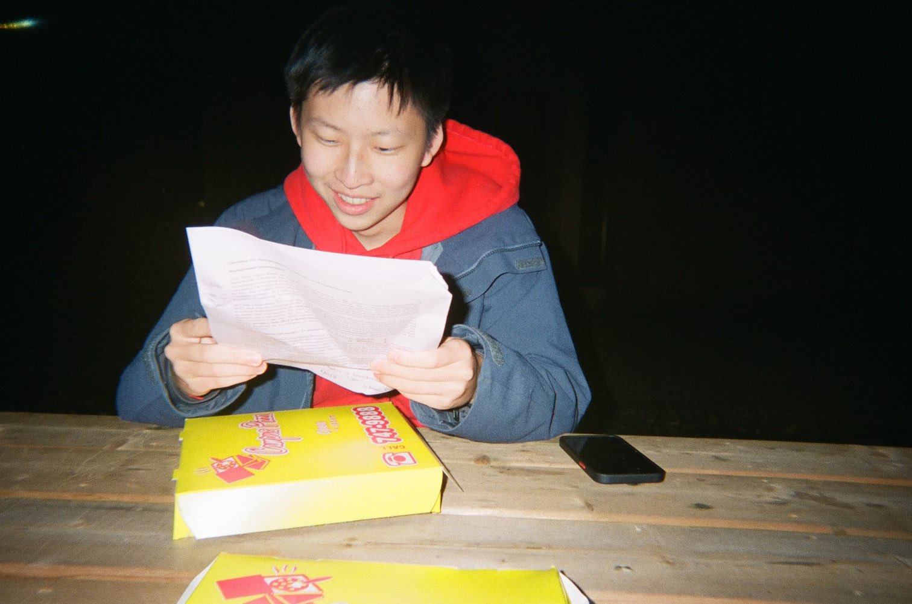

## Hi! My name is Alex Zhu (he/him).

Hello! I’m a Software Engineering student at UWaterloo. I like to think of myself as a coder and communicator: my goal is to lead driven teams to solve real-world issues through technology.

I grew up in the Greater Toronto Area, doing a large variety of things like running a YouTube channel, making podcasts, and debating competitively. At some point I became known online as the name *probablyalex* and the duck avatar you see plastered across this website. Eventually, I decided to study software to further pursue my interests.

In my free time I like to debate, play tennis and frisbee, make music and learn to cook. 👨‍🍳

## Latest Coding Jams 🎧


