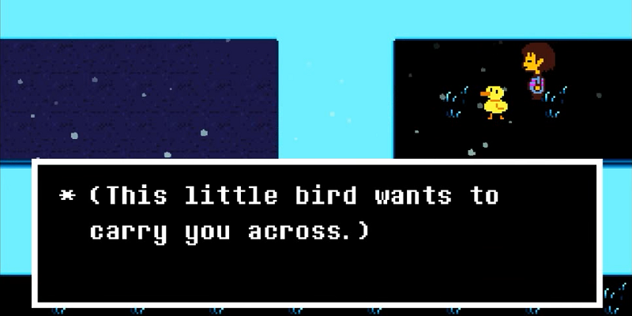

## Hi! My name is Alex Zhu (he/him).

I’m a **Software Engineering** student at the University of Waterloo. I like to think of myself as a **coder** and **communicator**: my goal is to lead driven teams to solve real-world issues through technology.

I care about doing meaningful, ethical work for the world. Other than coding, I love discussing philosophy and the environment. In my free time, I like to debate, play tennis and frisbee, and make music. Feel free to reach out on LinkedIn!

## Latest Coding Jams 🎧


