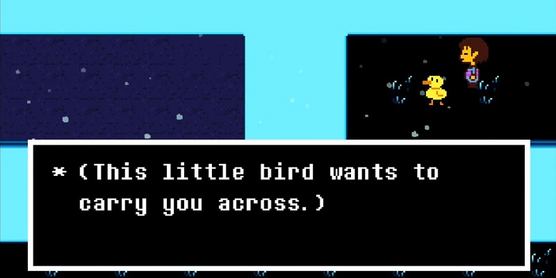

### Trivia
- I was raised in York Region, north of Toronto
- Things that shaped me: Andor, Range (David Epstein), Vlogbrothers, All About Love, Digital Minimalism, Adventure Time
- Countries visited, many for debating: 🇨🇦 🇨🇳 🇺🇸 🇫🇷 🇪🇸 🇩🇴 🇻🇳 🇵🇦 🇬🇧 🏴󠁧󠁢󠁳󠁣󠁴󠁿 🇸🇬 🇰🇷 🇯🇵 🇲🇾 🇧🇬 🇳🇱
- Some hobbies and interests: tennis, rock climbing, skateboarding, ultimate, following Toronto sports, filmmaking, producing music, painting, photography

### Camera Roll



### Avatar

The bird in this site's logo is the  Bird That Carries You Over a Disproportionately Small Gap from Undertale. I've used it as my avatar for years.

<figure class="bird-figure">
  
</figure>



### Recent Songs





