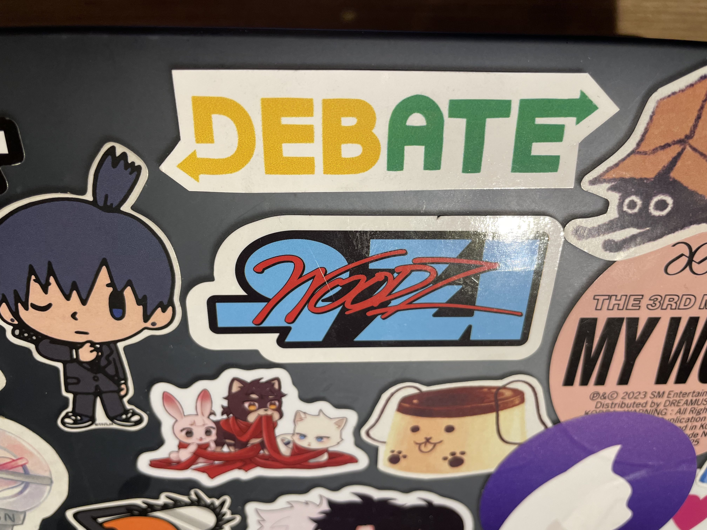

> How we spend our days is, of course, how we spend our lives.

Hi everyone, I haven’t written a blog in a while so I thought I would do a quick end-of-term update (also because my roommate Ryan reminded me to)! I’m currently at the White Rhino Cafe in Dallas, TX writing this, as Waterloo Debate is here for a layover on the way to Ho Chi Minh, Vietnam for the World Universities Debating Championship!

 Photo cred Taira")

## Debating 🗣️

I’ve invested a lot more time this term into debating, having competed at four tournaments and judged/tabbed at two, with WUDC yet to come. Debating took me on trips to universities across Canada and now across the world; it’s like being Isekai'd every other weekend to an alternate, non-Waterloo reality. I was worried that spending so much time debating would harm my grades, but I think it actually helped with work-life balance in the big picture (grades were fine — my average was safely over the magic number of 80 needed for opportunities like study abroad or research).

Additionally, returning to debate has been highly rewarding, just being able to spend time with cool people and make deep connections, as well as travel more. I’ve felt very fulfilled this term thanks to the company of others and I think those memories matter much more than a minor effect on grades. 

## Content Creation 📹

Filming the McGill Central Novs vlog was a highly rewarding reawakening of my creative side. I’ve done more music production and acquired a saxophone, but during my co-op term in Winter 2024, I plan on dedicating more time to content creation for Waterloo Debate as VP of Marketing. A friend and I are gonna go crazy on vlog and short-form content creation (including right now on the WUDC trip!), as well as designing a new brand for the club and merch like crew necks + more stickers!

## Reading List 📚
Over the summer before 2A, I read a lot of books, but I think that my favourite was *Range: Why Generalists Triumph in a Specialized World* by David Epstein.
- *Range* is a well-researched book about how having a wide skillset and being a jack-of-all-trades can actually be as beneficial as specializing, giving examples of Roger Federer (who played many sports and started tennis at eight) vs Tiger Woods (who was taught only golf from birth).
- My personal example is Auston Matthews, who was incredible at both baseball and hockey as a child; legend says he would hit a grand slam, then leave early to go score a hat trick.
- *Range*’s ideas have been incredibly liberating, in that they provide a practical justification for doing things that don’t seem related to goals or career progression. For example, debating or content creation seems very distant to software, but in some strange way, it ends up enriching skills that pay off in the long run even if they don’t lead to immediate career success.

Over co-op, *An Immense World* by Ed Yong and *All About Love* by Bell Hooks are on my reading list.

Uptown Waterloo has some really quaint bookstores like Old Goat Books and Words Worth Books; some really nice hidden gems to visit!

## Other Stuff 💧
- Co-op search was difficult this term — the market is really rough right now. Hopefully, the third co-op search will be better! I’m hoping to be more proactive and reach out for exciting opportunities, i.e. climate tech. 
- I’m working on developing a bit of fashion style, so hopefully, I can incrementally get a bit more dripped out. WUDC is giving us really nice tote bags and lanyards, so that's a start!
- Thank you to everyone who made this a memorable term!

### Merry Christmas and happy holidays everyone! 🎄