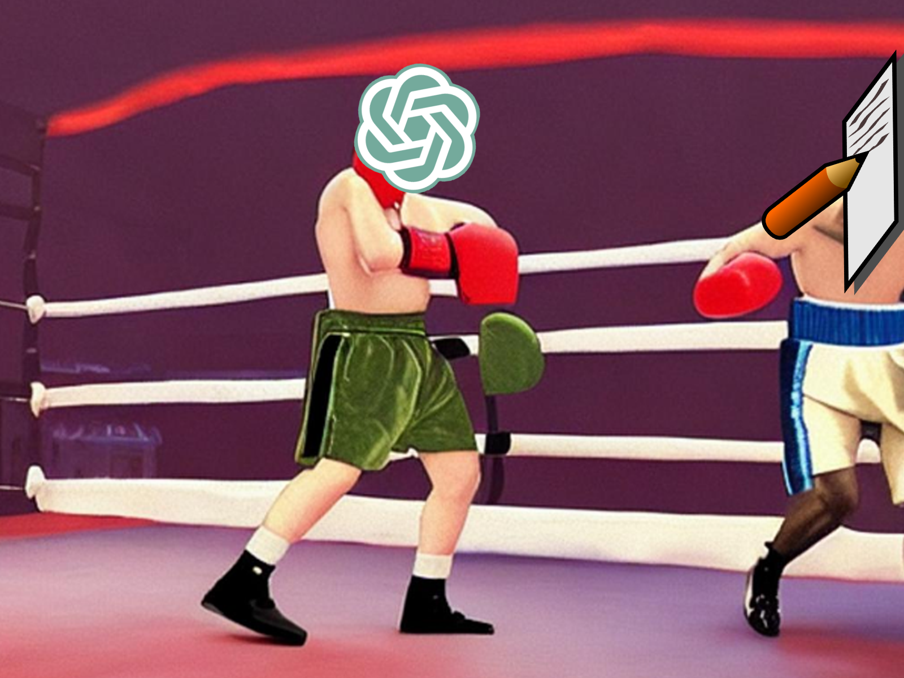

While I was writing a Facebook post introducing my friend David as director of a debate tournament, I started thinking about the creative writing process and whether AI would be able to do it or not. How good is AI at creative writing, and how might it improve in the future?

## What is ChatGPT? 🤖
ChatGPT is the current leading AI product that has people talking. It is a large language model (LLM) and generative pretrained transformer, which means that it has been trained on a massive dataset from the internet to transform data into text. You can give it prompts, and it will synthesize text to answer your requests. People have been asking ChatGPT to write poems, emails, speeches, and more.

While AI has been criticized for its factual accuracy, it is generally considered a good writer. I believe the opposite: the factual accuracy of AI will improve as it is trained on more recent data, such as newly published articles, but it will never surpass human writing. This is because AI is fundamentally not creative.

To borrow some ideas from Mark Manson's *Everything is F\*cked*, the human brain has a thinking part (frontal lobe) and a feeling part (amygdala and others). We have used our thinking brain to create computers which surpass our own thinking capabilties massively already. This looks like programmers thinking of better algorithms for finding the best move in chess, then getting checkmated by a CPU.

We are yet to implement a truly emotional/creative AI yet. Logic does not yield creative results; the type of thinking required is fundamentally different. Creative output is driven by human emotion; if we were purely logical beings satisfied by facts and numbers, we would have nothing to gain from creative work. The fact that creativity is hard to define is proof that we could not have programmed it into any AI yet.

Right now AI can pretend to be creative, but the day AI develops true creativity (the capability to make its own decisions and generate entirely new content) will be a milestone in humanity's story. This day is distant: we struggle to understand our own emotions (that's why the field of psychology exists) and are far from knowing how to model our brain into a computer program.

Anyways, how good is AI at *imitating* writing?

## What It's Good At 🥇
- Brainstorming things to write about
- Technical, academic writing where dry is okay (but needs fact checking to prevent *hallucinations* from being published)
- Helping foreign speakers communicate ideas with correct grammar

## What It Struggles With 🤯
- Knowing your audience's background information
- Writing sensible analogies, metaphors, anecdotes
- Having any tone or personality that feels genuine
- Coming up with puns
- Being succinct (it writes verbosely)
- Taking a perspective on an issue (if you ask AI about the trolley problem, it'll give reasoning that conflicts with its decision)
- Originality -- it merely synthesizes what others have already written (what happens when AI starts being trained on the output of other AI? Garbage in, garbage out.)

## Tips for Writing with AI ✍️
If you care about sounding genuine or standing out in your writing, be careful using AI to write your text.
- Be as specific as possible in your prompts to get results that align with what you need. For example, ask it to write with a humorous tone and tell it who the target audience is.
- Make sure to give the generated text that human touch by revising the output.

As with all other AI being released, use ChatGPT as a tool to supercharge your creative output.