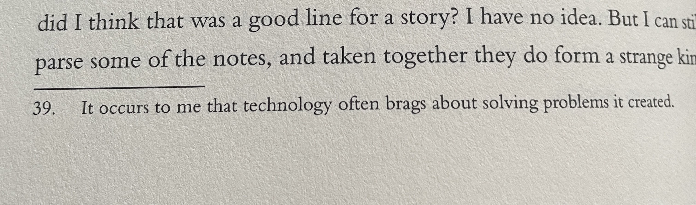
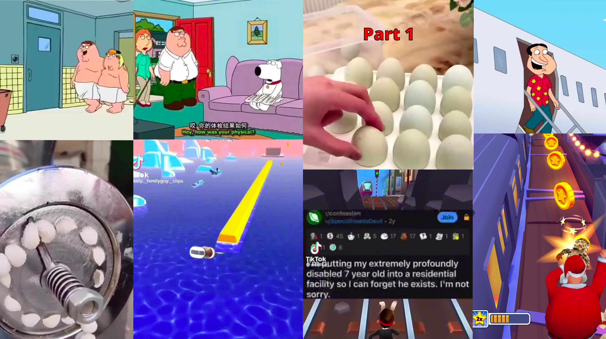

A while ago, I was reading *The Anthropocene Reviewed* by John Green, and came across this footnote.

Nothing can exemplify this more than the new Apple Vision Pro that was just announced, an even more convenient way to consume media. The marketing of the Vision Pro brags about making content more immersive and engaging by merging it with the real world and being available from anywhere. However, the problem that this solves is the constant need for distraction, which was really started by smartphones like the iPhone shortening attention spans many years ago. Nowadays, there are people who can't use the toilet without bringing their phone, and children who can't watch a 30-second video without a split-screen Subway Surfers clip playing.

We all have a limited amount of attention available to invest, and if we are spending all our attention on uncomplex leisure, we have less available to solve complex goals and provide for enjoyable growth. Not only that, but spending too much time online shrinks our attention spans and makes it harder to focus when we want/need to later. More attention spent on TikTok is less attention for rewarding activities that make you lose track of time, such as having conversations with people or playing sports. Technology has not only taken away our time but also decimated our ability to direct our attention, and the Vision Pro is potentially another terrifying leap in the wrong direction.

**One of the paradoxes of modern society is we have more entertainment at our fingertips than ever before, but many of us are actually less happy when consuming TV or social media.** Through the internet, we can read and watch things hundreds of times in a day that our ancestors could only dream of seeing in a lifetime, but they really don't improve our existence at all. As Mihaly Csikszentmihalyi wrote in *Flow*,

"Many leisure activities—especially those involving the passive consumption of mass media—are not designed to make us happy and strong. Their purpose is to make money for someone else. If we allow them to, they can suck out the marrow of our lives, leaving only feeble husks."

So to be happier, we need to win back our attention spans from parasitic  distractions by minimizing technology use to make the most of our free time. This is the concept of Cal Newport's digital minimalism: "A philosophy of technology use in which you focus your online time on a small number of carefully selected and optimized activities that strongly support things you value, and then happily miss out on everything else." Feel free to watch this great video for more information on the origins of digital minimalism as well!



Edit July 30, 2023: Having now read Digital Minimalism by Cal Newport, I highly recommend his book and considering the ideas in it. Part of what he says is that "quick fixes" only stick long-term if they're part of a broader philosophy that justifies the fixes being done, so make sure to understand exactly why you're taking specific actions.

My next post will be [Ten Tips for Digital Minimalism to Win Back Your Attention]( "Ten Tips for Digital Minimalism to Win Back Your Attention"). 