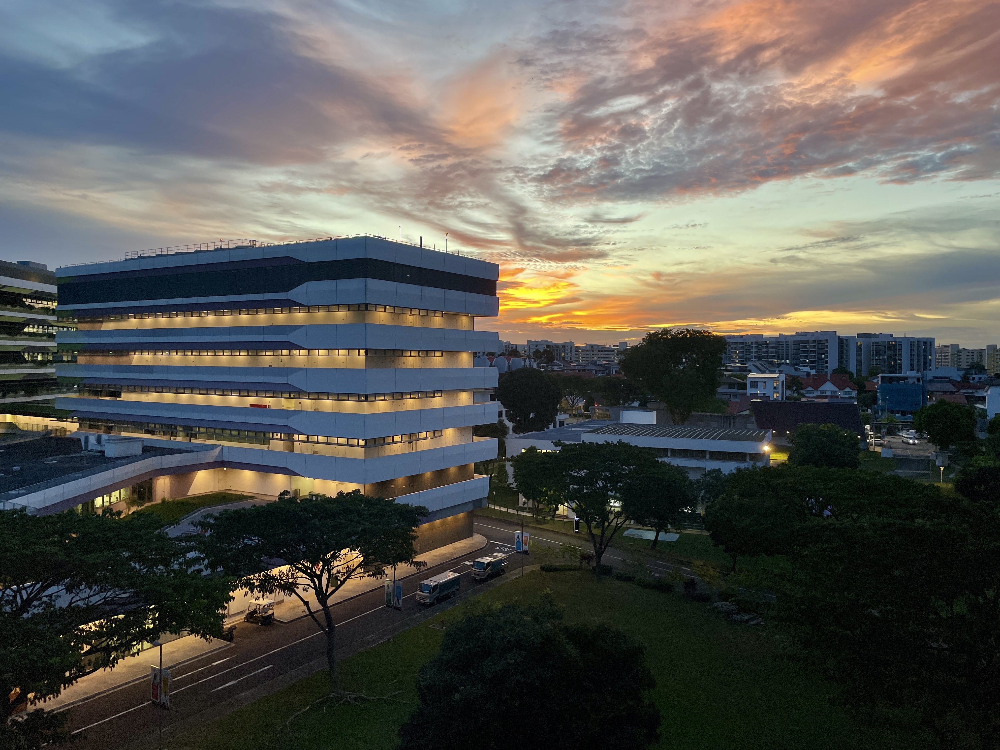

Quick post to recap what I learned during my exchange experience!

## 1. Self Growth
- Increased my confidence in overcoming challenging events, like needing a new passport and payment processing issues. Realized there’s no need to stress everything because things will work out one way or another
- That I really enjoy solo travel! You meet so many new people such as at hostels, get to do what you want, and take your time
- That I am better than most people at living with change, but there are limits to my ability to live transitorily, and that homesickness is real and can be challenging

## 2. Relationships
- Learned more about the nature of relationships, and how one can seek genuine connection even if you know it’ll come to an end soon.

- How valuable my existing friendships are and how excited I am to see them again

## 3. Other
- That hospitality is important and greatly valued — I will try to be more hospitable to others going forward. e.g. at Singapore debate tournaments, and Kota Kinabalu when a rainstorm suddenly hit and I needed help
- That I should spend more money to avoid troubles sometimes! One time I didn’t want to pay for an expensive taxi, and then my phone died before I could book another one, so got stuck in the middle of nowhere in Malaysia
- That life is worth living because of little moments that just *hit* for some reason, like food coma napping w/ Christmas music, or being on a speedboat w/ wind in your hair, or late-night supper at a casual Indian restaurant w/ new friends

- That the world is very different in different places, but that humanity is shared and common. We’re all kind of insecure, searching for jobs, and looking for a good laugh
- How much I love Christmas!

