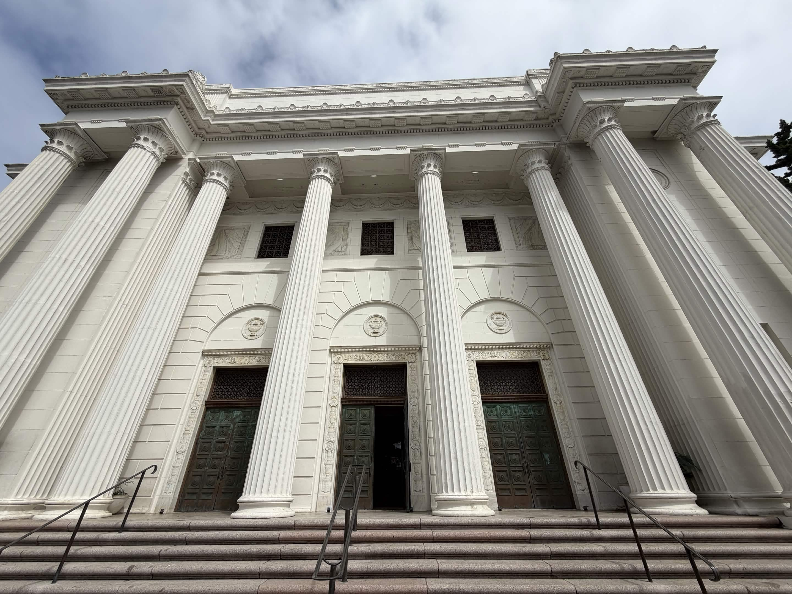
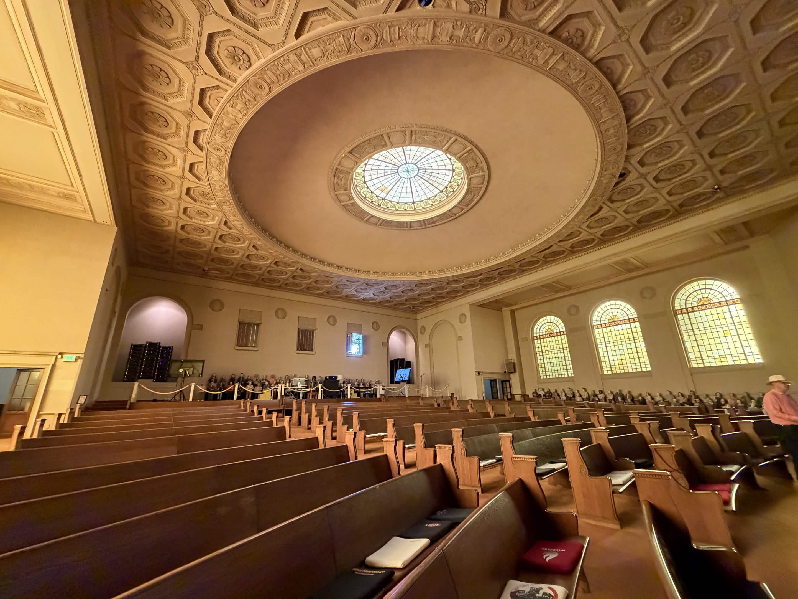
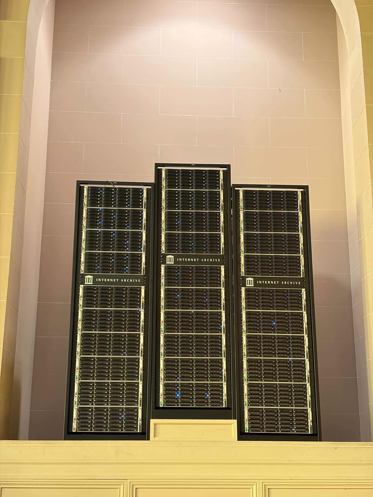
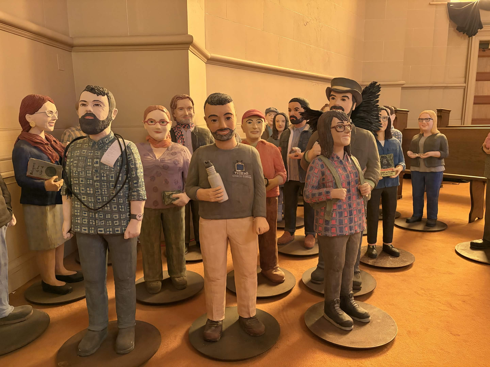
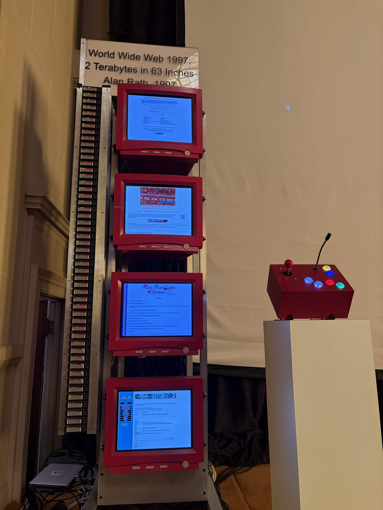
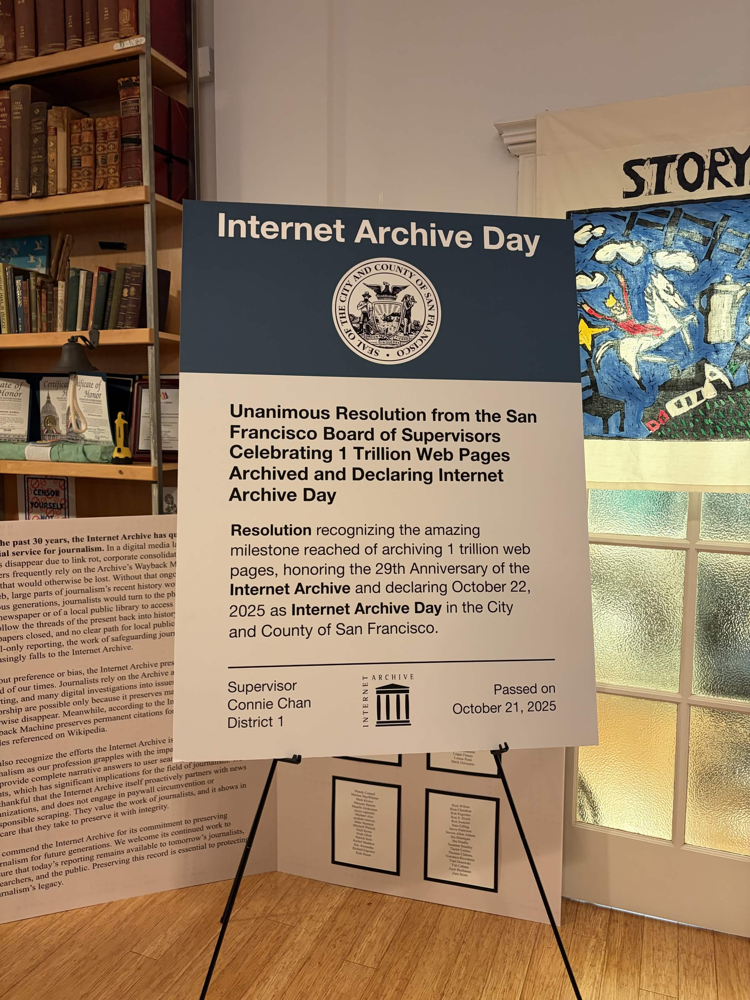

In the west of San Francisco, between the Presidio and Golden Gate Park, there's a hidden gem that serves one of the most important purposes in the world. Every Friday at 1 PM, it opens its headquarters to the public for a tour. This is the Internet Archive, a non-profit digital library offering free universal access to the knowledge of the world. Most well-known for the Wayback Machine archiving old versions of websites, they are also the home of petabytes of movies, music, global television, video games, and more.

{{< gallery match="{1,2}.jpg" >}}

The tour guide is [Brewster Kahle](https://en.wikipedia.org/wiki/Brewster_Kahle), the founder of the Internet Archive. He explains that yes, this is really a legally recognized library: preserving physical media, providing access for the public, and lending books. It's designated an official federal depository library. Brewster is extremely important, but he doesn't ever really introduce himself. Instead, he comes off as deeply humble and views the mission of preserving the world's knowledge, that we all contributed to on the Internet, as larger than any one person or corporation.

We start off in the lobby of the Internet Archive, where a large group is gathered. Many are from Stanford for a course on digital humanities, and others are here thanks to MUNI, friends in the film industry, and a viral tweet from fellow Waterloo student [Jaryd Diamond](https://x.com/jaryddiamond/status/2080797110224527515). The building we are standing in is introduced as a converted Christian Science church, selected as the home of the IA because the building resembles the logo of the Internet Archive, with its classical architecture and tall white pillars.

The mission, we are told, is to preserve media of all forms: the human-created stuff primarily, but also the porn, AI slop, etc. A hand-cranked gramophone and Edison cylinder are on display, starting off the story of technology being used to record content. A lady is working in a small room scanning books for the archives; we take a quick stop to acknowledge her hard work before moving on upstairs.

Upstairs past the lobby, we enter what was originally the massive church hall. Modifications have been made to turn it into more of a theatre but it still clearly resembles its origins.

First, Brewster shows us what is at the back of the hall, and the star of the show: two server towers that are literally where the petabytes of the Internet Archive's old webpages are stored. These are the primary copies; there are secondary backups distributed in other servers in the world in case this library meets the same fate as Alexandria. He tells us that the best part about these server towers is that the lights *really* mean something: every time a blue light flashes, an update is either being uploaded to a saved webpage, or a user is downloading/viewing a saved webpage from that drive. At various points, I've been one of those blue dots.

We shift from the back of the hall to the sides. Along the sides of the hall are terracotta soldiers of the people who work for the Internet Archive, using their talent and expertise for a good cause. They're memorialized like the forces of Qin Shi Huang, the first emperor of China. Brewster asks us if it's cool or creepy: the audience reaction is mixed.

Next, we shift into a pseudo-lecture, as the crowd settles along the pews and Brewster takes the stage. The wooden benches are thankfully lined with cushions of various nerdy descent, telling a story of deep tech lore. If I were to guess, they're made by putting old T-shirt merch around cushions.

{{< gallery match="{7,8}.jpg" >}}

On the two sides of the stage are numbers, which were part of the original church. However, they've been swapped out. On the left are the first 9 digits of pi, and on the right are three HTTP response status codes: *200 OK*, *404 Not Found*, and *451 Unavailable For Legal Reasons* (a *Fahrenheit 451* reference, the temperature at which paper burns).

{{< gallery match="{10,11}.jpg" >}}

There is also a tall artifact standing on the left half of the stage of the entire WWW in 1997: a measly 2 terabytes standing 63 inches tall. It's remarkable that the whole Internet could fit in so little space; even today's Internet, which is obviously exponentially larger, can still fit in relatively little physical space thanks to the efficiency of digital storage. Something this profound and interesting goes unmentioned during Brewster's presentation, like a comedian who brings a prop on stage and ignores it the entire time. He talks instead about various initiatives being undertaken by the Internet Archive, as well as the challenges they face.

Recently, the Internet Archive hit a milestone of archiving one trillion webpages. This important work continues despite lawsuits from media companies and governments around the world, and takedown requests from even the "good" outlets like the New York Times. But Brewster also wants to stress that they do so much more than that, such as recording global television feeds from around the world. It silently helps individuals, researchers, and journalists do their work, holding large institutions accountable and putting real power in the hands of ordinary people.

At the end of the presentation, we end up in a common area of sorts outside of the grand church hall. Kind staff of the Internet Archive make themselves available for conversations, as well as serve a variety of ice cream to all the guests! Cool stuff lines the shelves, and guests linger around to talk. In support of the work of the Internet Archive and to get some fire memorabilia for myself, I buy a tote bag and a pair of archive.org socks which I will be very proudly wearing.

{{< gallery match="{13,14,15}.jpg" >}}

There is far, far more to see at the Internet Archive than what I could recount here. If you get a chance, go visit this cornerstone of the Internet!
