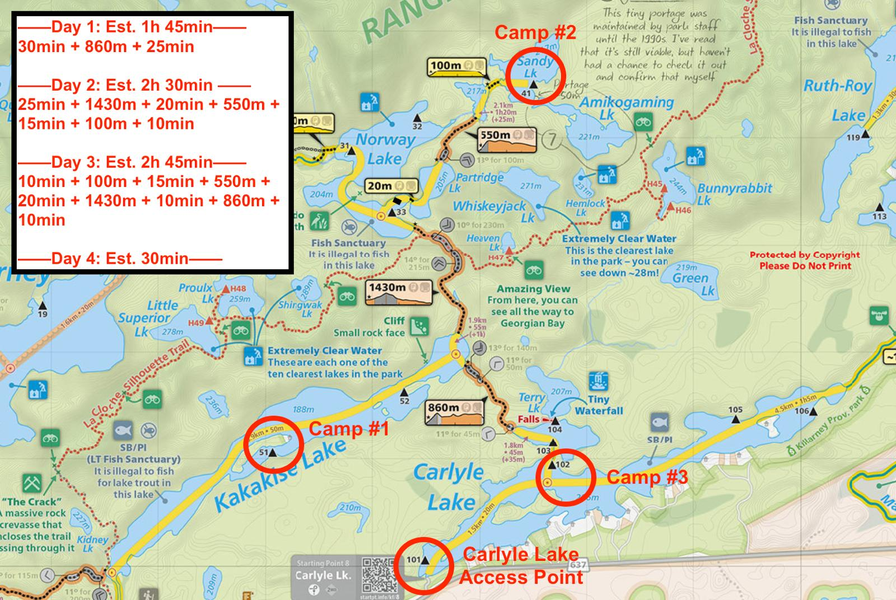
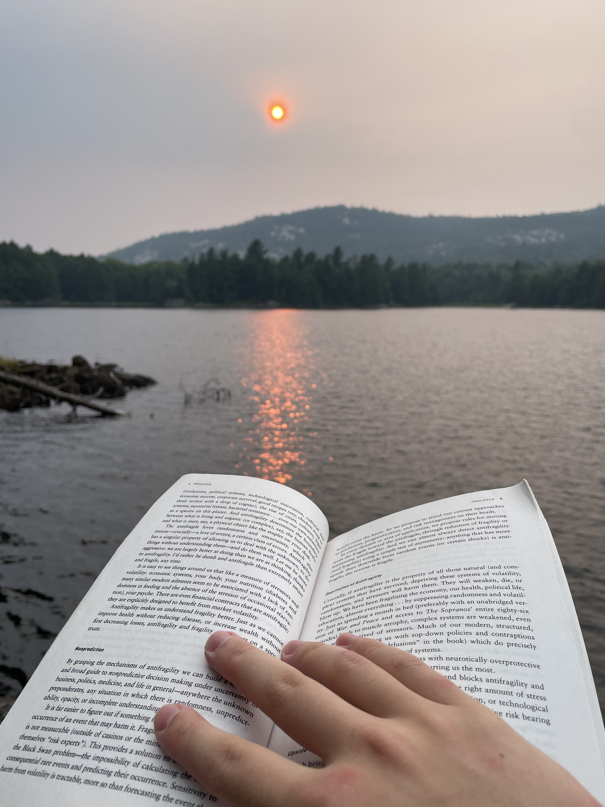
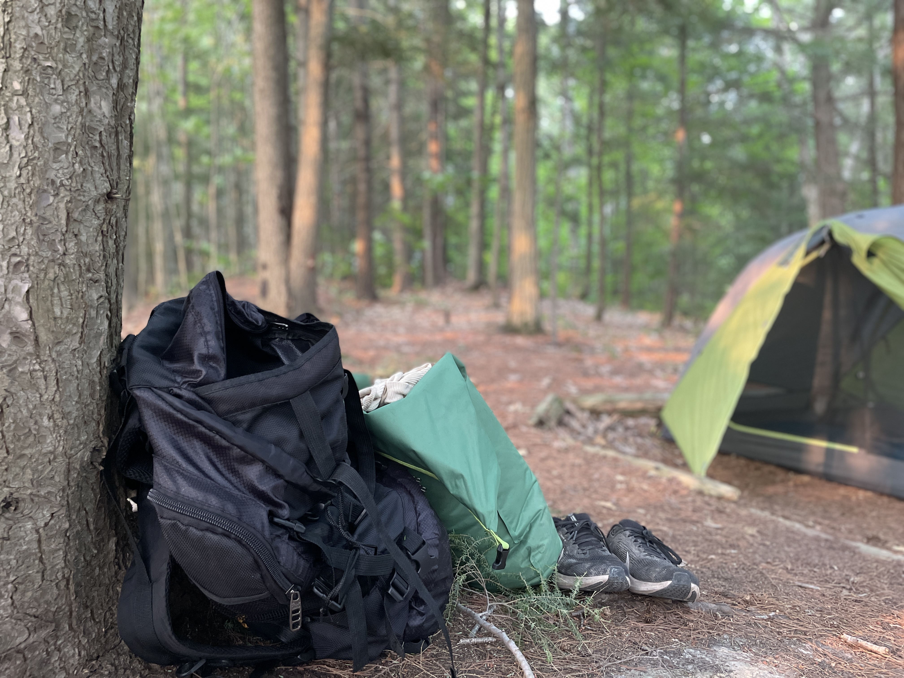

**Fun fact:** Ontario, Canada has over 330 provincial parks and more lakes than anywhere else on Earth: 20% of the world's freshwater supply is stored in Ontario's 250,000 lakes alone! Growing up here, camping was a regular part of my childhood thanks to my parents.

But now, as a software engineer spending record amounts of time indoors staring at screens, I’ve been missing that part of my life more than ever. Watching camping YouTubers like **Xander Budnick** (also from Ontario) reminded me how beautiful nature is — and how it can be the perfect antidote to the busyness and stress of everyday life. I realized I didn’t just want to think about camping again; I needed to make it happen this summer. 🏕️

I tried to organize a trip with friends, but most were abroad for internships. Luckily, my friend Ryan was game, and an opportunity appeared. His older sister and her husband were planning a long-weekend portaging trip with friends to Killarney Provincial Park, five hours north of Toronto on Georgian Bay. The group would be **four pairs of campers** (three couples plus Ryan and me) and two dogs, both new to camping themselves.

## Preparation 🎒

Before we set off, I had to figure out how to prepare for my first portaging trip. A quick primer: What is portaging? A portaging trip is one where you carry your boat and all your gear over land between bodies of water. It's camping in the backcountry: no service, no bathrooms, very few other portagers, and scenic lakeside campsites you can only reach by paddling and hiking.

I'd never portaged before, so this was a little intimidating. How would I manage carrying all of our gear and our canoe? How would I take a shit without toilets? That’s when I turned to two sources for help: friends and, yes, ChatGPT.

One of my newer friends, Annika — whom I’d met through varsity debate — turned out to be an insanely experienced camper, certified and all. She gave me gear tips (sleeping pad, 30L dry bag) and reassured me that **while experience helps, mindset matters just as much.**

From there, I jotted down my trip goals in Notion a couple of days before leaving:
- “Don’t be afraid to suck, just be eager to help.” -chatgpt
- same as what was said at work on intern impact review — great opportunities to learn, because there are no expectations on you
- be eager to help, eager to learn, have no ego
- goals for the long weekend: escape from to do lists, get uncomfortable, appreciate nature, learn lots

I wanted a mental reset from my constant to-do list thinking and the overstimulation that comes from cramming into packed buses in downtown Toronto every morning. **Paradoxically, portaging would be both a challenge and an escape: uncomfortable, but in the right ways.**

## Day 1: Mosquitos 🦟

After a five-hour drive, we arrived at the Lake Carlyle access point around 7 PM. We loaded our bags into the canoe and started paddling. Canoeing was familiar — I’d learned the basics as a kid — so I steered from the back while Ryan paddled up front. Soon, we reached the **first portage**: 860 m through the woods. Ryan carried the canoe; I took all our bags (two dry bags and a 50L backpack with food, tent, clothes, and a chair). The dry bags hooked to my life jacket like an albatross, banging into my legs with every step. In running shoes without much grip, I had to carefully manage my balance over rough terrain, destabilized by giant bags loosely attached to me.

Another short paddle later on Kakakise Lake, we reached campsite 1 and met with the rest of our camping group just as the sun set. Here's a less fun fact: with the most lakes in the world, we also have an insane amount of mosquitos in Ontario, which are especially active in August. Setting up camp in the dark meant headlamps — and a cloud of mosquitos drawn straight to our faces despite copious amounts of bug spray. We wrestled in the dark to set up a half-broken borrowed tent we'd never used before, swatting in front of our faces every few seconds. By the time the tent was set up, we already had dozens of mosquito bites, even through our clothes (by the end of the trip, I genuinely think I had over 100 bites).

Dinner, thankfully, was handled by Ryan’s sister and brother-in-law, with each pair taking turns cooking over the trip (resulting in great burrito bowls, sandwiches, delectable snacks, Outdoor Boys bread, etc.) After learning to filter water using a gravity filter, wash dishes in a portable sink without polluting the lake, and hanging our bear bag, we escaped into our tent. Exhausted, we laboriously inflated our sleeping pads, which covered the entire surface area available in our tiny two-person tent, killed the remaining mosquitos inside, and fell fast asleep.

## Day 2: Mud 🥾

After a surprisingly great sleep, we got up for day 2. We had to pack up and get ready for a much longer day of paddling and portaging, which featured a **1.4 km** hike from Kakakise Lake to Norway Lake. Unlike yesterday, we each carried our own gear instead of giving everything to the non-canoe carrier. I had a massive backpack with our tent and food, plus my dry bag clipped to the back.

This was my first time carrying the canoe. Following a YouTube tutorial, I lifted it onto my thighs, then rocked it like a cradle over my head onto my shoulders. The first hundred meters feel fine, but the weight quickly builds until your shoulders burn like crazy. Ryan and I split the 1.4 km portage, and toward the end, we opted to carry the canoe together by hand for a break. **Seeing the green foliage give way to the shimmer of Norway Lake was like spotting heaven after a long slog.**

After Norway Lake came one of the worst sections of the trip: Sandy Lake. Calling that lake "Sandy" is **straight up misleading**: that shore was pure mud. Getting in and out of the canoe meant sinking ankle-deep, yanking each foot free like pulling boots from wet cement. Sometimes a shoe stayed stuck in the mud, flinging muck everywhere. But after a certain point, you accept that you’re dirty and stop caring — discomfort becomes part of the experience.

We did our final portage to campsite 2 on Sandy Lake, which luckily had a rocky beach for docking. The whole group jumped into the lake to scrub off the mud — the first time we’d washed since the trip began. **What a beautiful feeling!** To be clean after a sweaty, muddy day and to finally be at such a beautiful campsite. After swimming, I changed into clean clothes for the first time all trip, read for a bit, took some photos, had dinner, and retreated to the tent before the mosquitos’ full wrath arrived.

## Day 3: Mindset 💪

**Day 3 was slated to be the toughest yet.** We’d retrace day 2’s route, plus an extra 860 m portage from day 1, and then paddle east to reach campsite 3. This would set us up for an easy day 4, just a short half-hour paddle back to the car.

We woke to the same smoky morning as day 2, the sky tinged orange from wildfires in Manitoba. I took my time packing, stretching, and mentally preparing for the long day. My shoulders ached from the previous day’s canoe carries.

Originally, we’d planned a day trip to Whiskeyjack Lake, known for having the clearest water in the park. But the group decided to skip it — everyone was tired, and getting to camp before mosquito “D-Day” felt more important. It was a good ego check: sometimes the smart choice is the less ambitious one.

We slogged back through “Sandy” Lake’s mud, but this time I wore flip-flops for the muddy entry/exit instead of ruining my running shoes for a second time. After Norway Lake, we faced the 1.4 km portage again — but somehow it felt easier. Ryan and I played music from my iPhone, rationing the battery to last the whole trip. It made a huge difference pushing through the pain. A good soundtrack can frame your pain as heroism.

For the 860 m portage, I volunteered to go first. The original plan was to split the distance halfway, but something came over me and **I just kept going**. Stepping over a log, ducking under another fallen log, hopscotching through a muddy patch, scrambling up tough elevation, and then cruising downhill after. Getting scratched by bushes, covered in mud and mosquitos, I just kept going. I pushed until I couldn’t anymore, carrying the canoe for about 600 m before handing it to Ryan, who gave me a big high five. That long stretch ended up being one of the most rewarding parts of the trip.

We reached campsite 3 earlier than expected. Ryan and I went for a short trip of our own to check out the "Tiny Waterfall", doing an unofficial portage to reach Terry Lake. For once, we were canoeing without our heavy bags and without a mandatory destination in mind. We jokingly renamed Terry Lake after ourselves, as if we were the first explorers to ever find that body of water.

Back at camp, we helped gather firewood and learned bushcraft skills: sawing, splitting logs, spotting good kindling, and carving feather sticks. Ryan and I capped the evening with hot chocolate made on a mini gas stove, using a still-sealed can of powder left by the previous group. Like day 2, we wound down with a great meal, then went to bed after another fulfilling day.

## Conclusion ✅

By day 4, heading home, I could see **I’d met my goals**. I got my mind off the to-do lists in a simplified environment where all I had to think about was putting one foot in front of the other. I got comfortable with being uncomfortable: wading through mud, fending off mosquitos, and carrying canoes over uneven trails. I appreciated nature from majestic lakeside campsites, the rewards of portaging into the backcountry. And finally, I learned valuable bushcraft skills and lessons I'll carry into future trips.

Somewhere between the ankle-deep mud of “Sandy” Lake and the shoulder burn of that 1.4km portage, **I found the stillness I’d been looking for**. If you’ve been craving a reset from our digital worlds, I can’t recommend camping enough. Nature has a way of stripping away the noise until all that’s left is the simple satisfaction of surviving and enjoying the day.
