### Prologue

During the past weekend, I went to compete at the Léger Cup 2025. It's a Canadian Parliamentary format debate tournament hosted at the University of Western Ontario. Although the tournament is usually relatively small (this one had only 16 teams register), it's also a titled tournament which represents the Central Canadian Championships for the central region of varsity debate in Canada. As such, the champion of the tournament gets the "Western Cup" for a year, a large bowl-shaped cup with two handles, and the names of the past winners from 1981 onward on its base.

In 2023, around two years ago, the first university debate tournament I had ever competed at was the Léger Cup. I did that one with my debate partner Ananya Bose, and we had a solid run to the semifinals. Last year, we competed again, and made it to the grand final and won the entire competition. That year, Léger only had 12 teams, and our clear nemesis was the team of Daniel Svirsky (president of the Canadian University Society of Intercollegiate Debate) and Ted Ren (our president of UW Debate). We took them out in the final on opposition on a motion about how it would be better to live in pre-industrial times. We took the Western Cup home, where Ananya and I shared custody over it, alternating between co-op terms.

It was really awesome to win it in 2024. Although the competition itself wasn't too competitive, the cup was a physical representation of all of the hard work we put into perfecting our craft of debate. The years of high school debate through COVID, arguing on Zoom in different time zones, doing drills and watching seminars, all manifested in this award. However, over time, the cup started to lose its lustre, as it collected dust and was lamented as just something taking up space in our apartments.

---

Before the start of the Winter 2025 term, The elections for the exec team of UW Debate were rolling around. No one was running for the two VP Training roles, two incredibly important positions responsible for running the weekly meetings of the club. Ananya and I were told that we should do it. Despite the heavy courseload I knew I was taking on, as well as a part time job and participating in the co-op job search, we agreed to take on the training roles for the term. This would be my third term as VP Training, and I knew I enjoyed the role but was also afraid that I wouldn't be able to give it my all.

The Waterloo debate club has always faced some structural challenges recruiting new members. Our school is quite STEM-oriented, so it's difficult to find people who are interested in public speaking and discussing non-technology related things. Additionally, the co-op program means that only half of our club is on campus every term, as people alternate between study terms and work terms. However, there was a core of members who cared deeply about the activity of debate and welcoming newer members to the club. There had been some firey discussion in the exec channels about how we needed to make stronger efforts to be welcoming, to create more opportunities for new members, and to really retain debaters. Under this context, our role as training in W25 started to feel like it had paramount importance.

---

I've always cared deeply about debating and introducing new people to the activity for the first time. When I was in middle school, I developed a stammer where I couldn't say words that started with B (although the stammer switched between letters as I grew older. For a while it was D as well). I was laughed at, although sometimes endearingly, but it still felt bad to be a poor speaker. I went to speech therapy sort of disguised as speech class, where I improved my stammer with breathing exercises. Still, it felt a little belittling as I learned to stumble through simple pieces of prose.

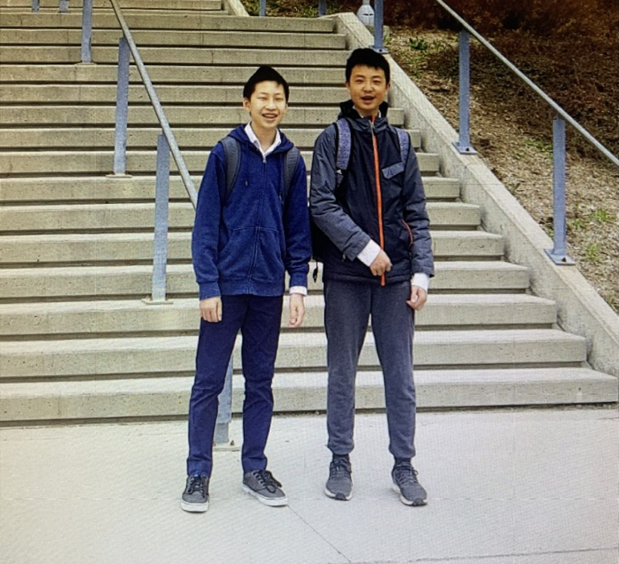

In high school, I picked up debating with encouragement from my parents. Even though my speaking skills weren't great, I fell in love with the activity. The critical thinking required was intellectually stimulating, the competitions were socially engaging, and the game was incredibly strategic and addicting. Over time, the activity helped me learn so much about the world through dozens of lenses (political, economic, legal, etc.), and it became a core part of my identity. I became a strong speaker with more confidence then ever before. I eventually became president of my high school debate club, where I ran weekly meetings to encourage others to at least try debating and see if it could add a positive element to their lives.

### Preparing for the Tournament

Ananya and I, along with our novice rep Sayan, started brainstorming how to run the W25 debate meetings as well as possible. We removed the show debate from our kickoff meeting in exchange for speaking games to get people comfortable with speaking in smaller chunks than the intimidating 7 minute speeches of British and Canadian Parliamentary. We ran lessons on the basics of the activity and worked hard to remove the confusing debate jargon that became automatic to us. We made sure everyone knew they were welcomed and celebrated their participation and progress, and hosted socials with dozens of people after meetings where we could all get to know each other better. Participation was up, and after three weeks, we were still filling three debate rooms per meeting, rivaling the numbers of big clubs like Hart House at UofT.

One big litmus test was registration for Léger 2025. At meetings, we told people that one of the best ways to level up their debate skills was to attend a tournament. We told people to register for Léger, as an opportunity to get to travel to another university, meet new friends, and of course improve at debating. Shockingly, the registration numbers were popping off like never before. We ended up with a 16-person contingent, one of, if not, the largest contingents we had ever sent to a tournament. We were sending four novice teams and two novice judges, with half of our contingent going to their very first tournaments ever. 

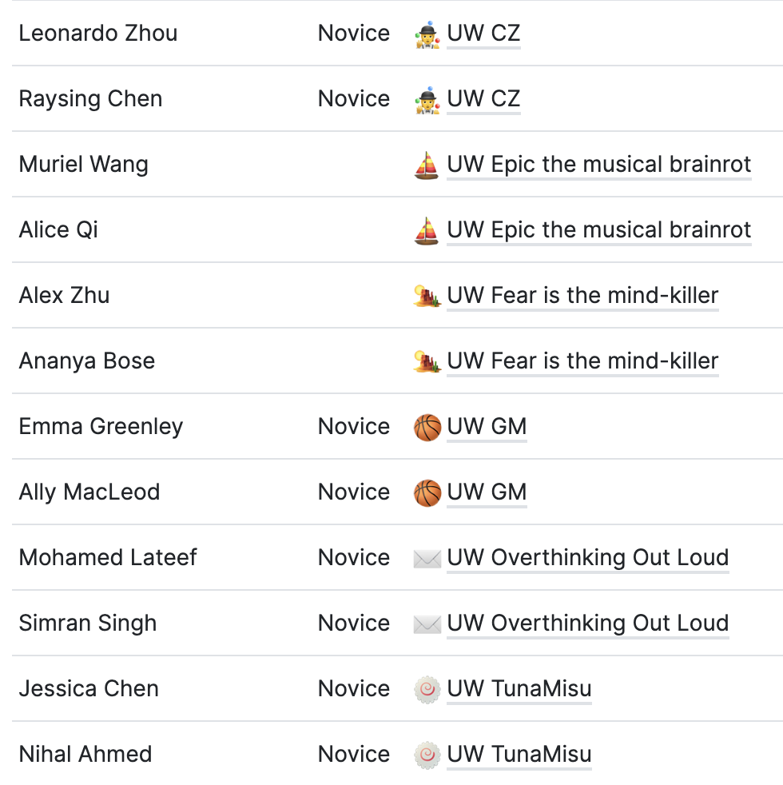
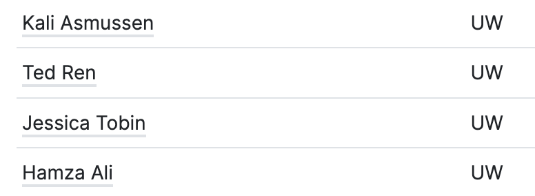

Originally, Ananya and I were not going to go compete to defend the title. However, seeing all the new debaters who were going, we wanted to tag along to support the new teams in their journeys. In the days before the tournament, along with Advait, who handles our tournament logistics, we scrambled to pair debaters into teams, help them learn the CanPar format, book their buses and figure out billeting, prep their cases, and ultimately mentally prepare them for a learning experience. The meeting before the tournament was moved online because of a snowstorm that shut the school down, but we persevered and had the meeting anyways on Discord. I gave an incredibly cringe pep talk comparing this first tournament for them to my experience in my first driving lesson, where I got forced to drive 20 km in half an hour, having never even touched a steering wheel before in my life.

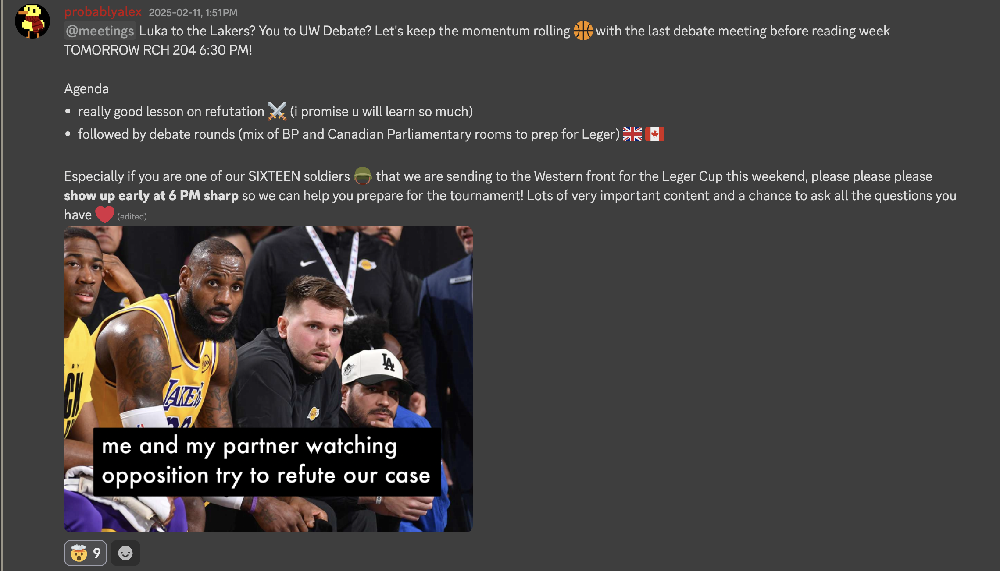

We also had everyone come up with team names: in 2024, after Dune 2, Ananya and I went as ⚔️ UW May thy knife chip and shatter!, so this year, we decided to repeat the theme and go as 🏜️ UW Fear is the mind-killer. Throughout this scramble, Ananya and I never really had a chance to prep our own cases for the tournament (in CanPar you have to bring your own motions and you can prepare ahead of time).

But eventually, the Friday before the weekend tournament came around, and we started shipping our biggest Waterloo contingent yet out to Western for Léger Cup 2025.

### The Tournament

It was incredibly snowy all weekend. At 10 PM, half the contingent waded in the snow to the bus stop, dragging our suitcases and the Western Cup there, and waited for the bus with new friends in the extreme Canadian cold. We eventually arrived in London around midnight, where we split off to our respective billeting locations. Ananya, Nihal (another debater), and I went to our billet Jacky's place, where we met Aiden from Laurier, another billeter. Aiden got the couch because he didn't bring a sleeping bag, and the rest of us slept around Jacky's fireplace on the floor to keep warm. Such are the hardships of broke unversity student debating.

We woke up at 9 AM and called an Uber to take us to Western campus where the competition was being hosted. Because of the weather, the wait for Ubers was pretty long, but pretty much everyone arrived a little bit late to the tournament. Eventually we got there, where we met up with the rest of the contingent, reassured that everyone had made it safely. We met our worthy competition, where there were many teams capable of winning the Western Cup to be theirs for the next year. The big cup that had lost its meaning in our apartments started to matter again, as it was put on display in the centre of the room, and other debaters huddled around it to read the names of past winners and imagine their names being engraved on it next.

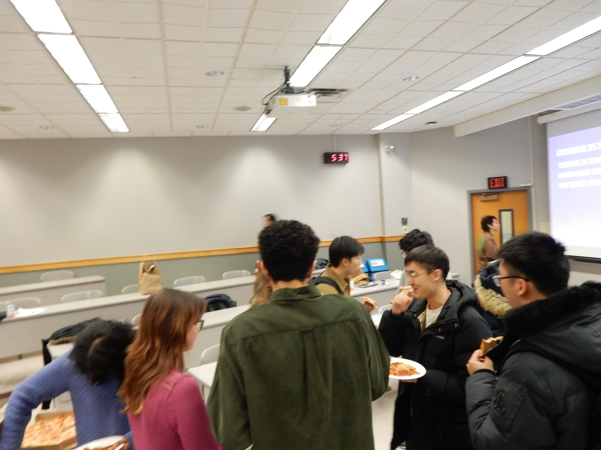

Pretty soon, the four rounds of debate began. I never remember my debate rounds very well, and they go by in a flash, so I'll spare you the details. We ended the day on 3 wins and 1 loss (on an old motion about chess streaming entertainment vs pro play we reused from 2023). We also debated against our own Waterloo novice teams twice, hitting Nihal and Jessica in rounds 1 and 4. Round 4 was a banger, as we ran Ananya's newly written motion about celibacy vs hookup culture, which featured banger Points of Information such as, "can lesbians get STIs?" During dinner, Ananya and I went off to write candy grams, a fun part of the tournament following Valentine's day, to all of the members of our contingent. We were really proud of everyone's growth mindsets (as cringe of a term as it is), and were really happy to see that people were having a good time and learning a lot.

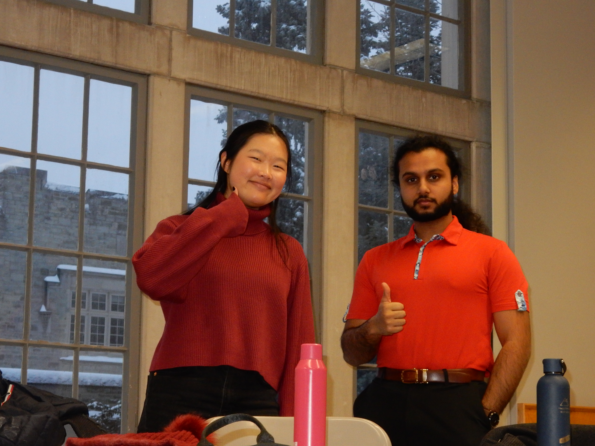

Later that night we attended the social at Byron's place, where we watched the Canada vs USA hockey game. But the best part of the social was actually when a few of us sober ones left it to take a walk in the incredibly peaceful snowfall, lit by the warm streetlights. It was one of the best experiences I've had at a debate social, as we joked around and threw snowballs at each other.

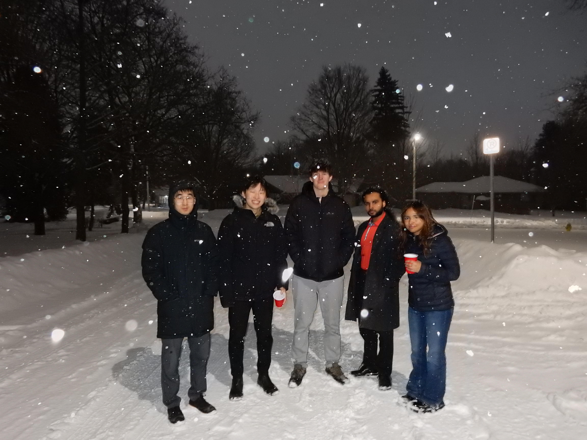

We got back back to the billet after the social around midnight. The gravity of the situation was dawning on Ananya and I: we had no more cases prepared for when we would inevitably draw government tomorrow in the remaining debate rounds. We stayed up until 2 AM being sweaty, prepping new topics. Aiden and Nihal helped us out too, as we all prepped cases together hoping that we wouldn't have to debate against each other.

---

The next day, as expected, we drew government in round 6 against a strong team (Raymond and Edward). We ran a motion inspired by my life that we had prepped the night before, about if a CS student from Waterloo should take a co-op offer from a big tech company or a startup. We defended taking the big tech company, and escaped with a win from a close debate. Good thing too, or I would have had to re-evaluate my life decisions (easter egg: I'm working at Shopify this summer, but I also got to connect with a really cool startup SELECT.dev).

At lunch, it was time for the break announcement, where they said which teams would move onto the outrounds (like the playoff rounds, where the top-performing teams compete in elimination style for the trophy). In the open category, we broke second with 5 wins and 1 loss, where the first place team (Patrick and Lily) also had 5 wins and a loss but better speaker scores. And amazingly in the novice category (reserved for new teams only), Nihal and Jessica broke second to secure a spot in the novice finals with 3 wins and 3 losses! They had a chance to defend the novice title for Waterloo, which Alice and Nyx from UW Debate had won last year.

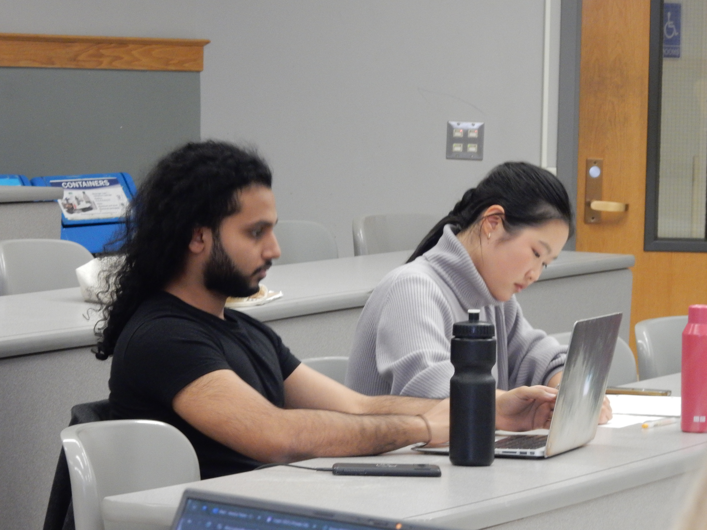

We were placed in a semifinal against the third seed, which was Raymond and Edward again, who we had just debated. We drew side government again, which means we needed to run a case we prepped. Unfortunately, we had nothing else prepared, so we had to reuse a motion again that we ran in the semifinals in 2024 as well: This House Prefers to live an anonymous life in South Korea as opposed to being a kpop idol. It's a Waterloo classic, debated and prepared many times by many Waterloo members (Taira, Elaine, Guo, etc.), and a very strong case about the harms of the kpop industry. Ultimately, we managed to win the semifinal again just as we did last year, but not without it being an incredibly nerve-wracking experience. The stage was set for the final, where the top team Patrick and Lily would be debating as opposition against Ananya and I as government.

---

Remember when I said we had nothing else prepared? This was a bit inaccurate. In 2024, having just seen Dune and having the Dune team name and all, we prepared a really epic case about if the Fremen should pursue revolution against the Harkonnen. We wanted to run it only in a grand final, as it was a motion too epic to be used in any earlier rounds, and we wanted spectators to be able to see the debate on it. But also, we were afraid to run it in the semifinal, because it hadn't been tested in a real debate before. Advait and other members of UW Debate had helped us prep it and test its strength as a case, but there was no sure chance it could win. However, we had nothing else prepared anyways, so in the spirit of fun and fear being the mind-killer, we were quite ecstatic to run it in the final.

> In a far galaxy ruled by powerful states, Arrakis is a desert planet and the only home for the highly-sought commodity “spice,” an abundant non-renewable resource found deep under the sand. Spice is necessary to fuel interstellar travel and extends lifespans threefold. Currently, the House Harkonnen is a ruthless interplanetary state with a technologically advanced military who has been in charge of spice mining on Arrakis and selling it to other galactic states for decades. These states want to keep Arrakis desertified and uninhabited to maximize spice production.

> The Fremen (five million) are the indigenous inhabitants who live on Arrakis, hidden survivalists oppressed and forcibly removed from their land by House Harkonnen. They are powerful fighters, having sabotaged spice mining operations in the past using guerrilla warfare.

> Their goal is a restored Arrakis rich with oceans where there is now sand and liberation from spice-harvesting outsiders encroaching on their dunes

> Motion: THBT it is not in the interest of the Fremen to pursue a revolution against House Harkonnen on Arrakis

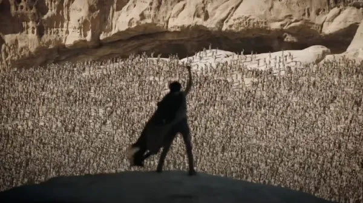

---

The spectators filed into the room and the judging panel sat in front of us. Our opponents sat across from us. I set up our Canadian Lazeez flag in front of our bench to represent Canada and Lazeez (Waterloo heritage), and the debate was set to begin. As the judges asked us to reveal our motion, we played the Dune soundtrack and proudly started reading out the info slide and motion. Ananya gave me a fistbump, and went to give my Prime Minister speech to set up the round. In the crowd, I noticed that our side of the room was filled with members of our contingent. New debaters and old debaters alike, cheering us on in this grand final in the name of university solidarity. It was really awesome to see such a large number of people supporting us in the final. I started my speech and really gave it my all, explaining how the Fremen should not pursue a revolution.

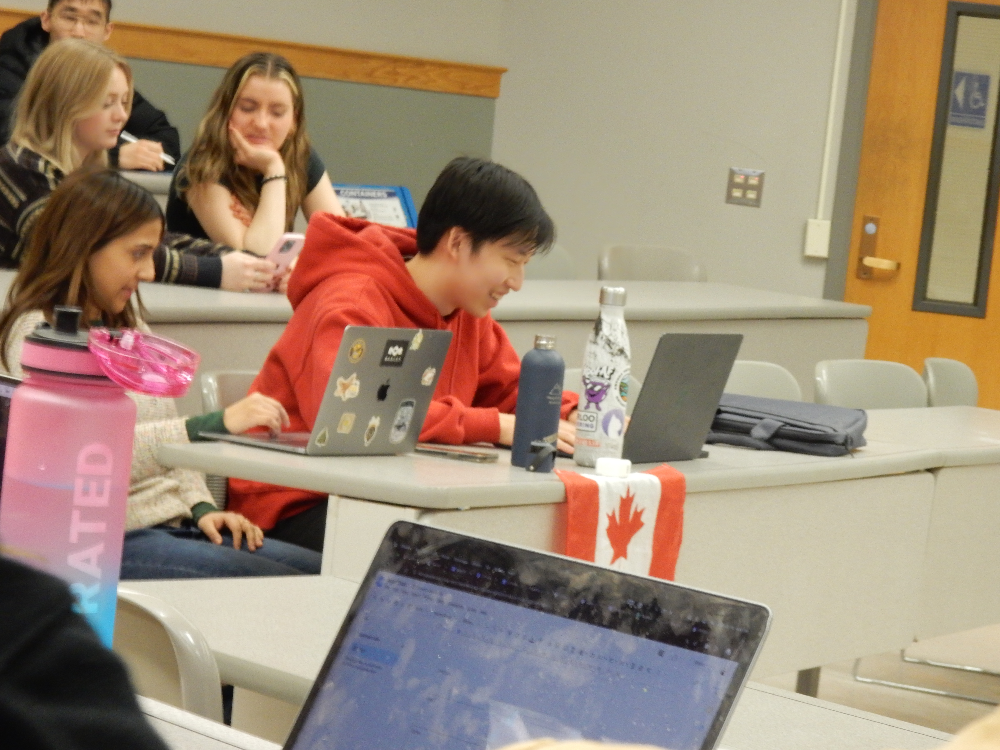

Essentially, the case is along the lines of the plot of Dune, where fragmentation and powerful Harkonnen allies cause the Fremen to be unable to succeed in revolution, or if they do succeed, at such high costs that it isn't worth it. The opposition case is about how genocide is likely to occur against the Fremen for spice harvesting, so revolution is necessary. But we explain how the Fremen can coexist somewhat, through defensive tactics like that of the Viet Cong. The case ends up being impressively strong against a very good opponent, as Ananya gives a Deputy PM speech to reinforce the costs of revolution and I give a reply speech to sum the case all up. We leave the debate convinced that we have won.

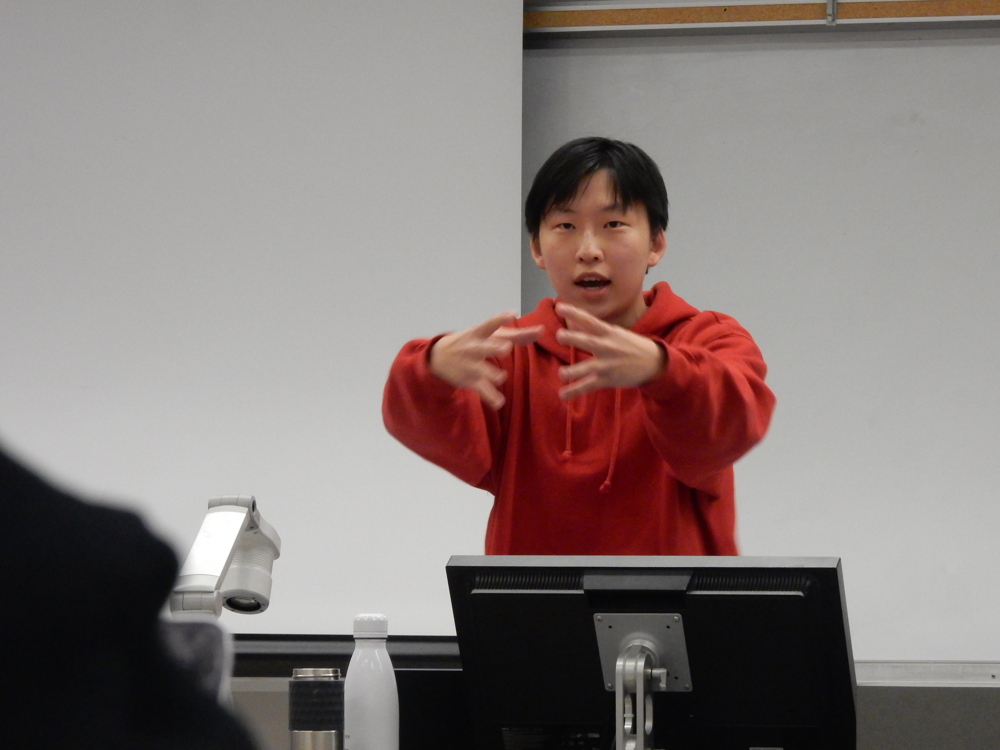

A few minutes later, the results are announced, and indeed, Ananya and I won the grand final and defended the Léger Cup title! The Western Cup was ours once again, now revitalized with meaning, and our names would be engraved on the cup twice. Additionally, Nihal and Jessica won the novice final, meaning that Waterloo had, for the second year in a row, won both the open and novice categories at the Léger Cup. We celebrated, chanted WATER WATER WATER! LOO LOO LOO!, thanked our opponents, and bid farewell to everyone.

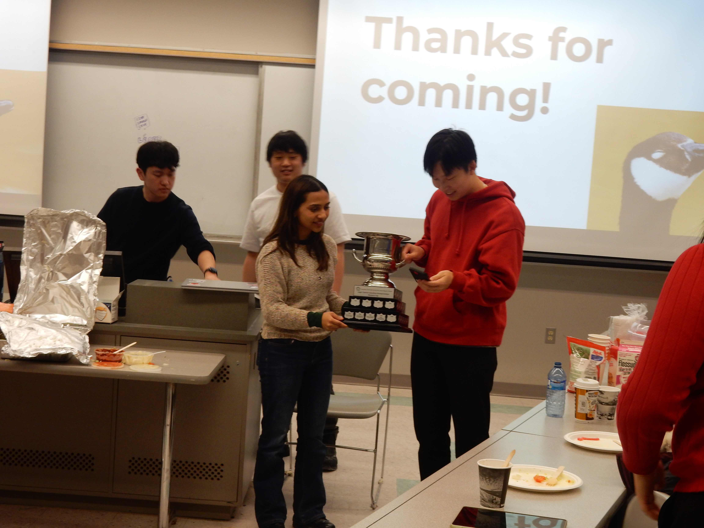

### Reflections

Our bus back to Waterloo from London was delayed 3 hours due to the snow, but luckily for us, that leaves us plenty of time to reflect! We ordered Chipotle (thanks Hamza), reflected on our respesctive tournament experiences, and braved the cold some more waiting for the bus.

Firstly, this win was meaningful because it established that Ananya and I were deserving of the title and that last year was no fluke. We improved on our record from last year, having only one debate in 8 rounds this time around. We also got to do it off of a motion that we had prepared and were so excited to run, so it was definitely a high point to have won it all off of that motion.

Secondly, it was amazing to see all of the new debaters at Léger. It seemed that the new UW Debate members had enjoyed their experience, both from learning to debate and also the social aspects of it too. If you're reading this, it was really awesome to meet all of you, and thank you so much for giving debate a chance! We are really excited to have you all, and you were all bringing really great vibes. I'm super proud of everyone, especially those who were nervous beforehand but proved to themselves that they could outperform the ceiling of what they thought was possible for themselves. We hope you keep on debating in the future, and perhaps eventually doing the same thing of introducing new people like yourselves to the activity as well.

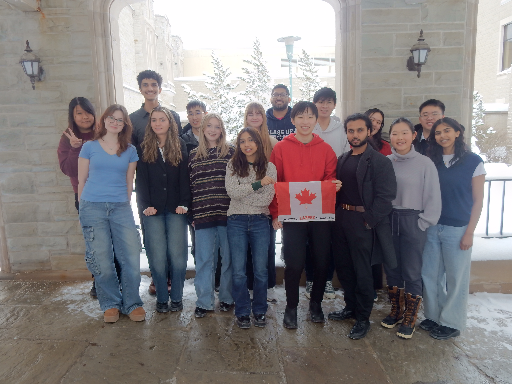

I'm really grateful for what debating represents, and the Léger Cup really represents my progress in this activity well. Thanks to everyone who organized and competed! I'm also very grateful to Ananya for debating with me despite recovering from a cold, and to many other people as well (too many to list out here). Sometimes debate feels fake, as Ted, Raysing, Muriel and I were discussing on the last-leg Uber from the bus back to our places in Waterloo. But everything is fake; through social agreement, things are given meaning and become real. And the moments of connection we have at tournaments, like doing push ups in the cold waiting for the bus, are certainly real too.

I leave you with a quote that sums up our Léger run:
> The visions are clear now. I see possible futures, all at once. Our enemies are all around us, and in so many futures they prevail. But I do see a way, there is a narrow way through.