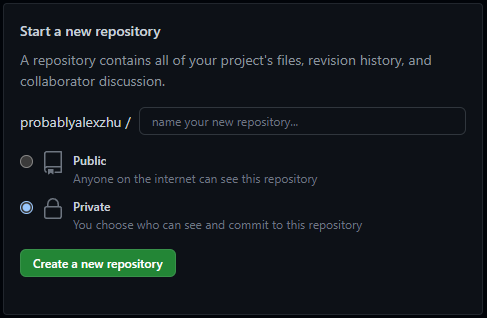

No one really teaches Git and GitHub, but it's a **must-know if you're ever going to develop software in a group** (like at a company).

Git (2005) and GitHub (2008) are not the same thing, but they are used together. Git is a distributed version control system that **you download**, a system that tracks changes in files. GitHub is an **online** host that uses Git to store files and do version control. Using Git and GitHub is important because it allows people to collaborate on code and roll back if they mess something up. In fact, I'm using Git right now to update this website! This tutorial will get you up to speed on how to use Git & GitHub together in just a few minutes.


## 1. Download Git, Make GitHub Account 🙋‍♂️

Download Git (free, open source, lightweight) for your computer here: https://git-scm.com/. The most important thing it will add is commands starting with the prefix "git" that you can type in your terminal. **Did you know the IDE Terminal (e.g. VSCode) and the Command Prompt are the same thing?** In a terminal, you will need to tell Git your credentials so it knows who is sending code before you begin any projects.

```C
git config --global user.name "your name"
git config --global user.email "username@example.com"
```

Make a GitHub account at https://github.com/. Ideally, the email you use for GitHub is the same as the email you use for Git. You can customize everything at any time, but **do not make it indecent** as you will likely use this account for academics and work among other things.

## 2. Make Your First Pair of Repositories 📦📦
 
**A repository is a location where data is stored.** You will make **two** repositories, so two places where your data will live simultaneously, one **local** on your computer and one **remote** on GitHub. On your computer, a repository is just a folder that you put files inside of. On GitHub, you create a new repository from your homepage as such.



## 3. Commit Your First Code 👩‍💻

After you write some code in your local folder, you want to send it to your remote repository so that it matches. You can do this in terminal (either Command Prompt's or editor's with the following commands. **For your first time, follow the code below.** The comments provide a technical understanding, you don't need to type them:

```C
cd 'directory-name' //change directory to your local folder, if you need to exit a subfolder do cd ..

git init // turns your folder into a newly initialized repository
git add . // add all files in the folder to be committed
git commit -m "first commit message" // commit all the files and write message that will accompany the change on GitHub
git branch -M main // sets the change to occur on the main version of the code
git remote add origin 'URL' // sets destination of code to remote repository at that GitHub URL
git push -u origin main // sends the code to the main version of the code on GitHub. Done!
```

### Vacation Analogy to Understand What You Just Did :beach:

Using the analogy of a vacation, imagine your computer is your local airport.
- When you *change directory*, you choose what code luggage you want to take with you. :luggage:
- When you *initialize*, you grab a new tray at the bag check-in. 🤏
- When you *add*, you put your chosen code into the tray. 📥
- When you *commit*, you put the tray with the code in it onto the conveyer belt and add a tag to explain the contents of the luggage. ⛓️
- When you set the *branch*, you tell the check-in agent which luggage conveyer belt the code should be received on at the destination airport (e.g. the main one). 🛃
- When you *add* a *remote origin*, you tell them what airport the luggage is going to. 🗼
- Finally, when you *push*, you push the tray of code down the conveyer belt and it arrives at the remote destination! ✈️


## 4. All Done! Future Use 🔮

Now any time you edit your code locally, the airport agent already knows where your code has to go, so all you have to do is:

```C
cd // if necessary into your local repository
git add . // put code in tray
git commit -m "explanation of change" // put on conveyer belt
git push // send it to its already known remote destination
```

If there are ever new changes on the remote repository that aren't reflected on your local repository (which happens if other people have been working on it from other places), you will have to `git pull` first to copy the changes to your computer. This gets rough when someone else changed code you're currently working on; then you will have to deal with merge conflicts (not fun).

**Congratulations!** You know how to get started with Git and GitHub now! You can code collaboratively, track changes quickly, and do version control. As a next step, you can learn about different ways to use Git and GitHub other than the terminal and how to deal with merge conflicts.

Make sure to leave a comment if you have any questions or learned something from this.