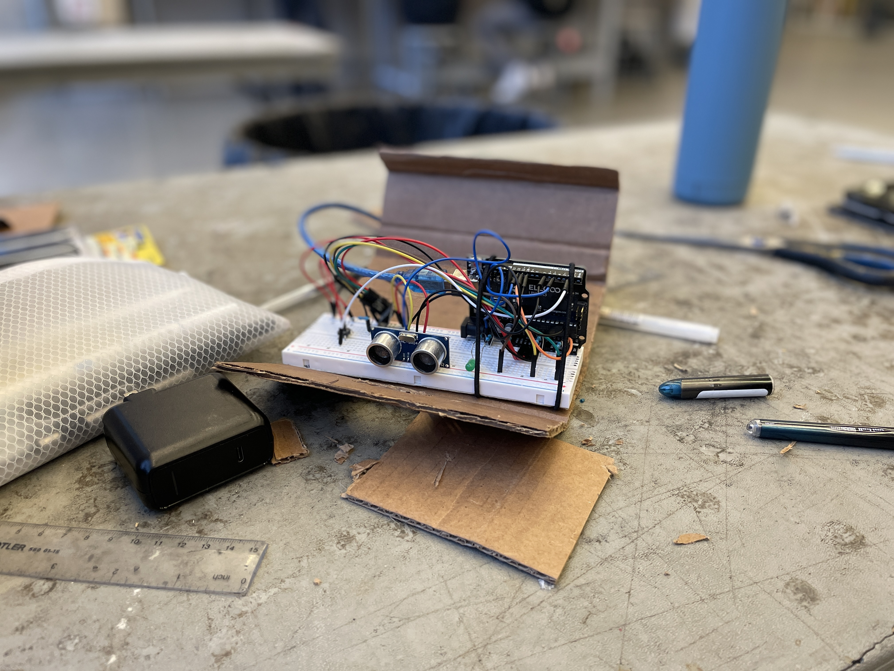

**Our final project for SE101 was supposed to be a exercise tracker device that would revolutionize the fitness experience. It ended up being... let's call it a good learning experience.** A lot of this article only exists thanks to my group members' efforts, so thanks to all of them for being great team members as we persevered together.



As software engineering students, it was tough when our final project guidelines forced us to use hardware. No one on my team of five, *4Fun*, had much hardware experience, so we had to research a lot from scratch and made a lot of mistakes on the way. **My plan in this article is talk about what we made on a technical level and provide takeaways for the future.**

## What We Made 💪

Hopefully you find the video entertaining. I must admit I was quite proud of the video we filmed and I edited, but I also must say that our cohort has some very talented video producers! One of my favourites was the skit about the gambling addict who needed special glasses to win at Blackjack and save his family.

Anyways, the Github Repo: https://github.com/benymng/4FUN

4Gains is a little device you put on a weight stack and it counts your reps, sets, and provides feedback on your performance. The feedback is all sent to a web app you can view on any device. I worked mainly on the hardware and backend sections of the project.

## Hardware 🦾


This was our first time working with Arduino. We hooked up an Arduino Uno R3 to a battery, breadboard, and connected an LED, HC-SR04 Ultrasonic Distance Sensor, and ESP8266 Wi-Fi module. At first, we had programmed in an accelerometer to calculate stability, and planned to also program a sound sensor along with the distance sensor. However, we realized this was not the play for two main reasons. One, the power that three sensors would draw from the Arduino would be too much and make all the sensors not work properly. Secondly, the baud rates, the rates that data is transferred in a communication channel, were different for all the sensors, so the code would be pretty messy as well.

We also had crazy trouble setting up the ESP-8266, and getting wireless communication to work probably ate up a fortnight of our team's time. The issue was power supply, not something we could really fix without buying a ton of new parts. Instead, we just had delay times between every command required to connect to Wi-Fi. This really slowed down progress, as every test would require a minute just to connect to Wi-Fi. This issue was made worse because we needed to connect to someone's phone hotspot, as the university's wifi interface was too secure for our questionable device to connect to.


### Hardware Takeaways :bulb:
1. **Hardware is hard, so do less.** While in software it may be easy to program three sensors that all inherit the "sensor" interface, it isn't as easy to scale up in hardware projects. If it can be done easily, do it easily.

By only using the distance sensor in hardware, we could calculate the acceleration by taking the derivative. No need for an accelerometer! We could also count reps and sets based on how high or low 4Gains moved up and down the weight stack. Do not make things more complicated than they need to be, especially on the hardware side of things.

2. **Integrate first.** Write shitty versions of your code and make sure all of it works together; hardware, backend, and frontend. This ensures that your final project will actually work. But on top of that, it means you can test way faster.

After we had Wi-Fi connection working (mostly), we eventually started testing the hardware code without connecting to Wi-Fi every time. This saved us lots of time when coding the rest of the hardware, such as the LED response and detecting when the user is done a set (see below).

```C
/* Code Snippet of arduinoFinalWifi.ino */
// end set if statonary too long
if(countTime > 25) { // 2.5 seconds
    // create string to be sent to web server
    String countRepString = "!" + String(countRep) + " ";
    String combined = countRepString + toSend;
    sendData(combined);
    // Serial.println(combined);

    // flash the LED!
    for(int i = 0; i < 8; i++) {
      digitalWrite(ledPin, HIGH);
      delay(125);
      digitalWrite(ledPin, LOW);
      delay(125);
    }
}
```

All in all, I feel like working with the hardware taught me a lot and I'll be a lot more confident working with similar in the future.

## Backend ⚙️

On the backend, I wrote ParseGraphForDistance.py, which used the BeautifulSoup library to parse the text on the web server via its IP Address that the Arduino sent to the hotspot network. It then sent the text to the MongoDB database, where it would be analyzed to create takeaways like if the user is lifting too much or too little, and graphs that are displayed on the web app. For the prototype presentation where we didn't have a database yet, I also used numpy to graph the data as a proof of concept of what the user would be able to see in the final product. These were both new libraries for me, but I am also much more comfortable with these now than before. It's really great how many new things you are forced to learn when building a project!

Unfortunately, I coded what is likely the weakest link in the program. However, this is by nature of the hardware being underpowered, and not me being clumsy. Since the ESP8266 Wi-Fi module wasn't powered well, the data it sent to the server was on-and-off, so the BeautifulSoup parser often failed to access the server and retrieve the data. Here's the httplib error that we have no control over:
```C
A connection attempt failed because the connected party did not properly respond after a period of time, or established connection failed because connected host has failed to respond
```

### Backend Takeaways
1. **Do research before you design your system.** At Waterloo, we're lucky to have access to a ton of human capital, mainly engineers that do hardware frequently (not us). We should have asked them what the best way to get data from an Arduino to a database was. We dived into building after just doing some Google searching, where we concluded that since we can't read straight from the Arduino serial monitor without using PuTTy, the best option must be uploading to a web server and parsing the text. Our solution is really like trying to pour water from a shower to an anthromorphic alligator through a bunch of complicated pipes, and hoping nothing leaks.


It turns out there's a much more direct solution, which another group figured out right before the deadline. Connect the Wi-Fi board, preferably a ESP32 that can be powered separately so it is fully powered, to the hotspot and upload data to a cloud server hosted by a service such as Render: Cloud Application Hosting. Then, host a JavaScript file that runs 24/7 on the cloud server that pushes the data to a MongoDB database anytime there's an update to the server. I believe this works better because it draws less power as it doesn't have to create its own local server, and you don't have to manually run the parsing program on a computer on the same network as the Arduino. 📶

## Frontend 🎨
Oh yeah, and here's the incredible frontend that really ties our project together. I had no hand in any of this, but it was very cool to watch. Our team started by designing it on Figma, then implementing it for real with React and Tailwind.


## Conclusion
The SE101 final project was a great learning experience. I'd like to thank my team again. In the end, I'm proud of our team for pulling together and creating something beyond what I thought was possible before we began, and I believe the rest of the teams in the cohort likely concluded with a similar sentiment. We all watched the past years' project demos and thought, "what am I doing in this program, these guys are all cracked," but once we did it ourselves, we slowly built the projects we had dreamt of.

### TL:DR of my takeaways of the project once more:
1. **Hardware is hard, so do less.**
2. **Integrate first.**
3. **Do research before you design your system.**