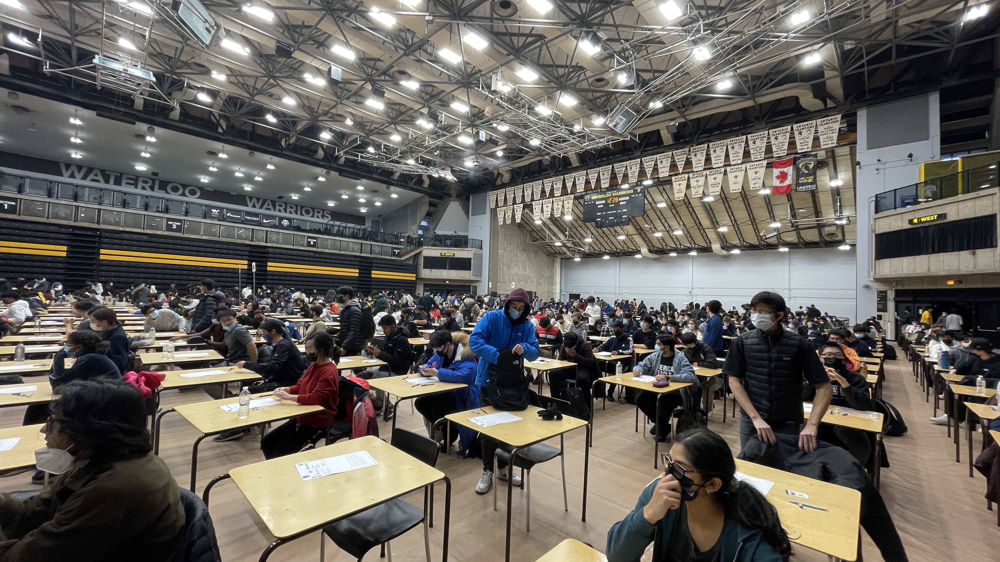

This is what I learned about studying and lifestyle during my first study term in Software Engineering at Waterloo! This post is intended to reach future students to give **advice**, as well as current students looking for someone else's perspective on 1A.

### 1. Learn, Don't Memorize 🤯
In university, the curriculum is more difficult than in high school. The testing is based on a **real understanding** of the content, not on being able to perform rote processes (like balancing chemical equations). If you only try to memorize, you will perform poorly and receive low grades.

Make sure that you understand content for real, not just memorize how to do things. Try **explaining concepts to others in many perspectives**, like understanding the cross product visually and algebraically.

To learn more, I suggest reading Waterloo Professor Dan Wolczuk's excellent learning resources: http://wolczuk.com/learning.html. I also suggest watching this video by competitive programmer Colin Galen:



### 2. Wield Your Dopamine 🧪
Dopamine is released in **anticipation**, and less so in receiving a **reward**. It causes habituation of behavior that seeks for high dopamine, such as opening a social media app, but these **habits** take time and anticipation away from other things.

Some people suggest a "dopamine detox" to make you more interested in more boring things, but a detox doesn't really work. This is because dopamine codes people to anticipate rewards, and the longer you restrain yourself from receiving a reward, the more likely you are to just **binge** a reward, feel shame, and go back to your bad habits.


Cut low-value distractions from your life and replace them with high-priority activities.


Instead, it’s better to **replace** bad habits with things that give you more bang for your buck. Instead of looking forward to scrolling social media, look forward to your next study session (the actual act of studying, not a reward you get for studying), intramural, or friend hangout. Enjoy life to its max!

You can learn more on this perspective from YouTuber Sisyphus 55's video:


### 3. Be Authentic 🤪
Don't try to be cool to make a bunch of friends and turn into a new popular figure at university. **Be yourself**, and even if you are less popular, the couple of friends that you do make will really like the true you and what you offer them.

Having too many friends makes for shallow relationships and a lot of stress. It's better to have just a few close friends that you really vibe with. You can study together without as much distraction, work on projects together, maybe become roommates in the future. Just **don't force yourself to be inauthentic** and a different person just to seek popularity.

