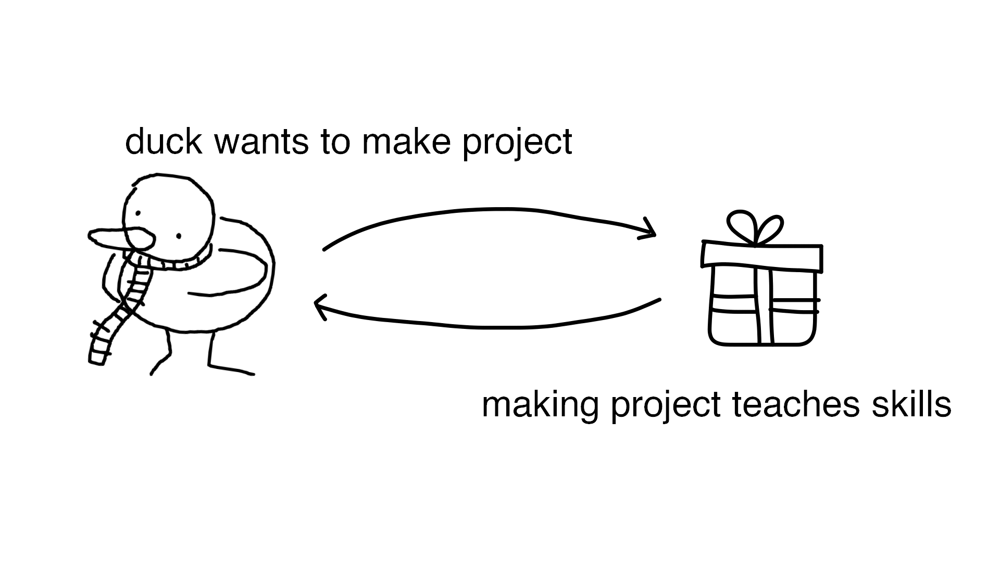
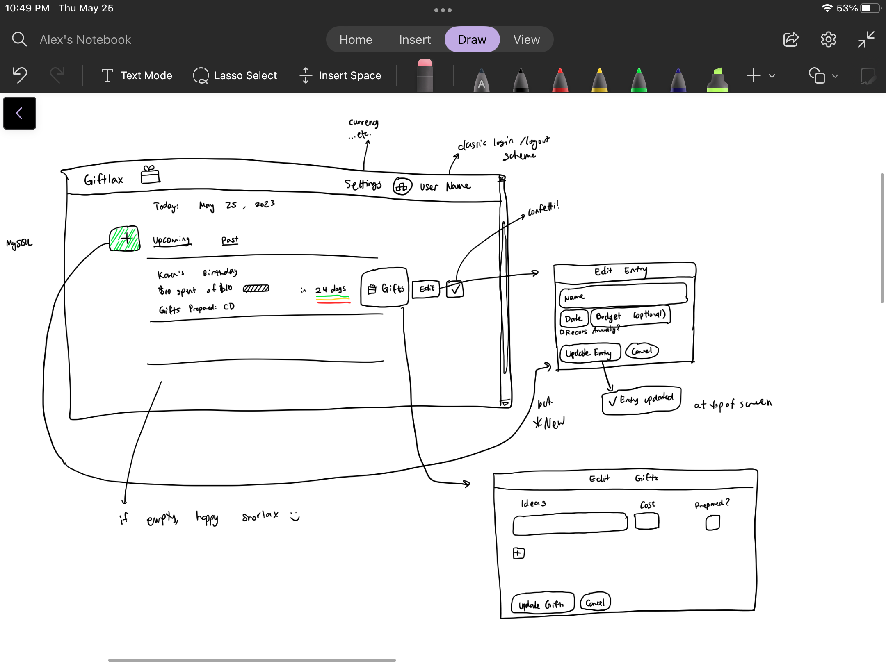
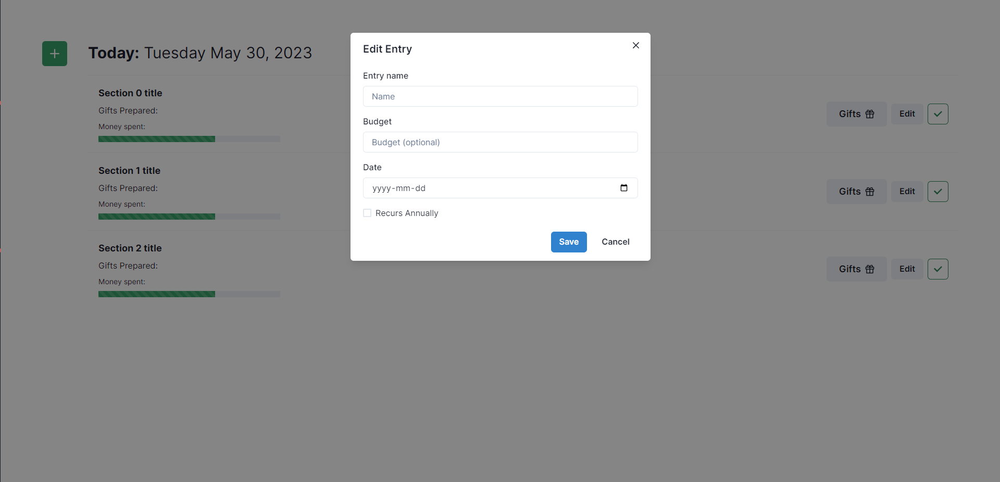
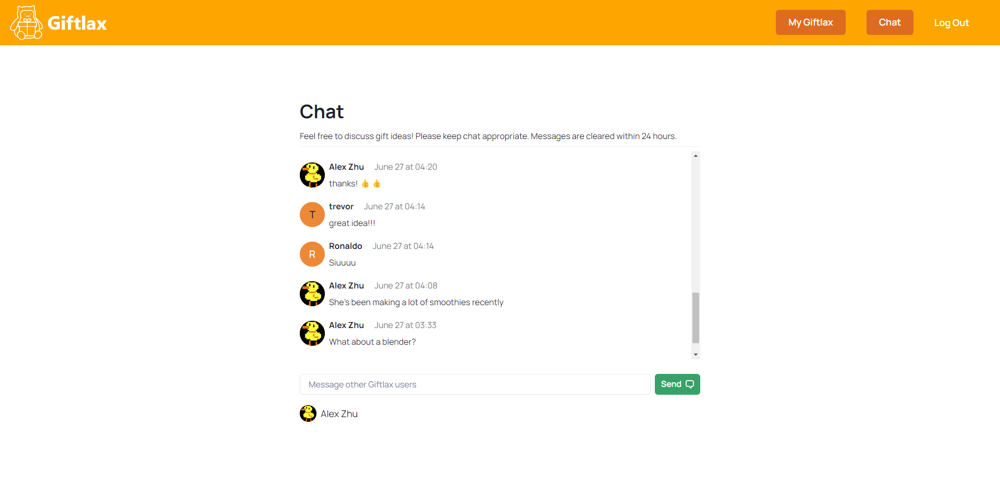
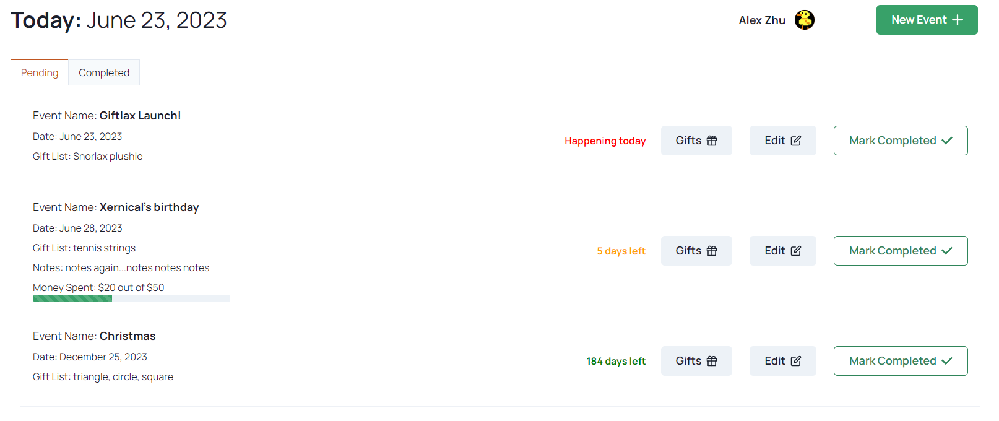
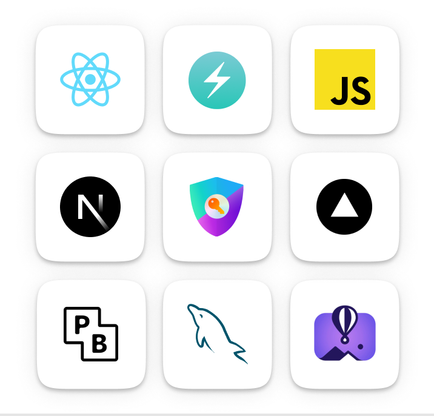

**Project-based learning is one of the most enjoyable and effective ways to learn new skills.** You get to develop something uniquely fascinating to you, and the work is just challenging enough at the edge of your abilities to be fully engaging. **Here’s how I learned full-stack dev by creating a project and you can too!**

Check out the final project here: https://giftlax.vercel.app/

## 1. Figuring out what to make :thinking:

I wanted to learn front-end development, specifically React, and how to work with databases like SQL or MongoDB. **These were holes in my knowledge as I hadn’t had a chance to learn these technologies before, so I decided my project would include these technologies.**

To turn these skills I wanted to learn into a project, I could have worked on a stock project like a to-do list or notes app. However, this would a) not be fun because I don’t care about making another notes app, and b) look unimpressive because you could easily copy existing code to make something stock.

Instead, I thought about what I wanted to make. I suck at remembering and deciding what to give people as gifts, so I designed a gift tracker to help people plan and think of gifts to give. This idea already exists, but the few apps that execute it are not very notable.


**Ultimately, the most crucial thing with project ideas is that you ideate it yourself and create it yourself, even if it already exists in some form.**


From the idea, I thought of a minimum viable product idea with just the four CRUD functions (create, read, update, delete). I sketched a simple UI on my tablet, taking inspiration from Mobbin, an excellent UI & UX research website.

## 2. We do a little learning :school:

Before jumping in headfirst, I read through the React docs https://react.dev/learn to learn some basics about how React works at a lower level. This taught me about crucial things that would have been confounding while developing, such as lifting state up, the difference between states and props, server versus client-side rendering, and how hooks work. This general understanding helped massively while debugging code later, but I also didn’t spend infinite time reading docs before jumping in (probably <10 hours reading docs total). **After learning about half of everything I wanted to know to get started, I dived into the project as I would learn the rest as I went.**

## 3. Getting started 🚦

**For full-stack, I built the front-end first and then added the back-end database later.** I created a Next.js app since I planned on deploying it to Vercel later, and they work well together. I followed the documentation and YouTube tutorials to get set up with creating a Next app with the React framework. Unbeknownst to me, I used the brand-new Next.js 13 app router with the /app directory, so very little documentation was available. This newness led to a few hiccups during development without much online help, but it worked out fine with a couple of hours of extra debugging.

**To save time making components that had some semblance of aesthetics, I used the component library Chakra UI.** This decision probably saved me days of just designing components. Following the minimum design I sketched earlier, I started assembling components and created the basic front-end layout that the final app would have.

## 4. In the thick of it 👨‍💻

Using Auth.js, formerly NextAuth.js, I made it so you would have to log in to view certain pages. I followed one of the only tutorials on environment variables and setting up Google Cloud for app authentication for Next.js 13. Along with that, I turned the one-page application into a website with a home page and a separate page for the app to live on.



Now, it was time to set up a database. I learned some SQL using Khan Academy, as I wanted to understand relational databases better to fill a gap in my knowledge. **Even though a non-relational database would have worked fine, I prioritized learning in choosing my tech stack.**

**From a Fireship video, I discovered Pocketbase, an open-source SQLite back-end that was super easy to set up.** I ran the database locally on my computer first, then integrated it into my app, making API requests from asynchronous functions as needed. This connection between the front end and database was super satisfying, like docking a spacecraft to the ISS after hours of tinkering.



Once the database established a connection to the front end, I implemented more features and tested their effectiveness by interacting with the local database. **Eventually, I decided to scrap together a chat app quickly to add to the project to demonstrate the real-time and multi-user capabilities of the database.** Finally, I got my friend to test the app and give feedback, and cleaned up the app with some pretty front-end components and transitions.

## 5. Deployment 📩

I’m a cheapskate when it comes to deploying things online. Pocketbase is entirely self-hosted, so I did it with the free resource allowances from Fly.io (https://github.com/pocketbase/pocketbase/discussions/537) and then deployed the Next.js front-end on Vercel + GitHub. In theory, the app should now run free forever, although something will prooobably go wrong :)

## 6. Conclusion 🙂

**Overall, the whole process of project-based learning was a ton of fun.** I encourage anyone learning anything new to do it through an original project idea; there are so many online resources nowadays to help with the process.

