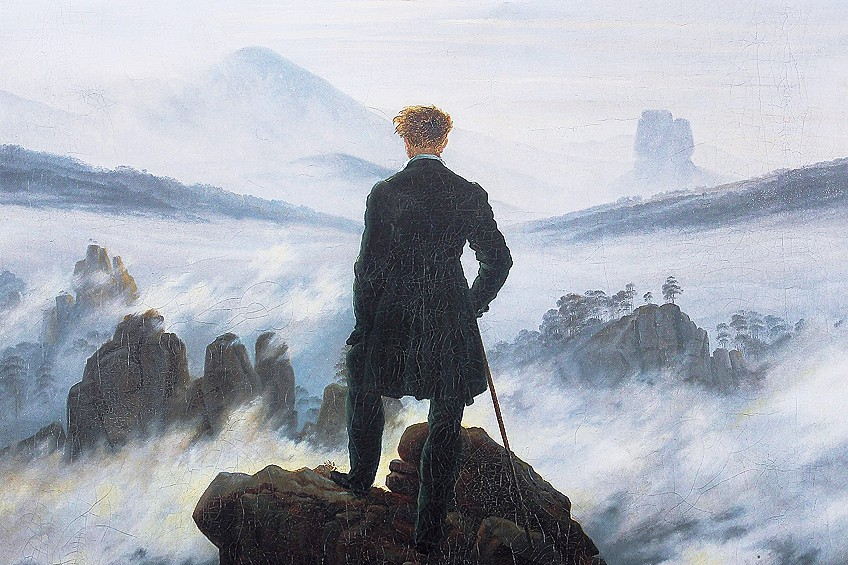

Please read: this is not about relationships. This is about why I want to blog, and why you should read my blog. We should be reader and writer :hearts:

## Who? 👨‍💻

**I'm Alex Zhu, a software engineering student in SE '27 at UWaterloo.** I grew up in the Ontario GTA and did a variety of activities, never settling on one thing. Random fact, but this isn't my first blog. The first blog I wrote for was on the website I made for my Clash of Clans clan, Derp Kingdom, during my childhood. This blog is one of my latest projects that I want to put a significant chunk of time into.

**But this blog is really about you. I hope to write for you, fellow peers and journeyers in the tech field.**

## Why? :thinking:

**I want to teach others.** I don't have a lot to share, but if we all share the little that we know, the world would be quite a bit better. Every person who replies on StackOverflow is someone's GOAT. I hope my posts can provide the tiniest glimpses of insight, and maybe something that provides some value to you. I really want to hear from you! If you ever have questions about any of my ideas, feel free to leave a comment.

## What? 👨‍🎓

**I plan on blogging about my thoughts on life related to self-improvement and projects I work on as a software engineering student.** No guarantees that it'll be any good for you, but a new perspective can never hurt. In terms of projects, there's a real joy in creating cool things, and a very real urge to show as many people as possible what you've created. As a result of my motivations, updating this blog is likely to be erratic and based on the ebbs and flows of writing inspiration.

## My Blogging Goals 🚨

Firstly, I want to consolidate my knowledge further by articulating and writing it a second time. As W. Edwards Deming said, "If you can't describe what you're doing as a process, then you don't know what you're doing." Throughout my journey, I want to make sure I'm storing what I've learned in my inventory so they can help me with whatever the current opportunity is. By blogging, I should be able to recall what I learned from my past experiences easier. Why not social media? It simply isn't a space catered for more formal thought or long ramblings, and you have little or no control over your content.

Secondly, In high school, I debated competitively almost every weekend. Even though I'm studying software, I still enjoy using my language skills (not programming languages) and I want to keep them sharp and put them to good use.

I'm hoping that in half a year, there will be a wealth of ideas and a small community built around this website that enriches everyone's lives. The internet can do great things for people, and many of them start at a grassroots level like down here.

## Final Words ✍️

Every day, we have formative experiences that can change our worldview and improve who we are. This could be talking to a mentor, on the train, working in a team, or playing a video game. Many people know that these experiences can happen, and they do well in seeking out these experiences by leaving their comfort zone and doing new things.

What may be slightly less common is really capturing these experiences. I believe that by living in the moment and being receptive, you can get conclusions and learn from even seemingly mundane events. Then, by writing these ideas down, you can retain them better and create something real that you can follow. For me, this blog is an outlet for my ideas to help me grow.

For you, it is hopefully a less mundane part of the mundanity of life and a place you can learn from.

**Thank you reader!**