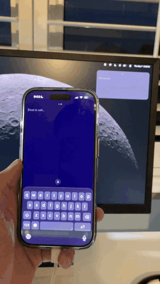
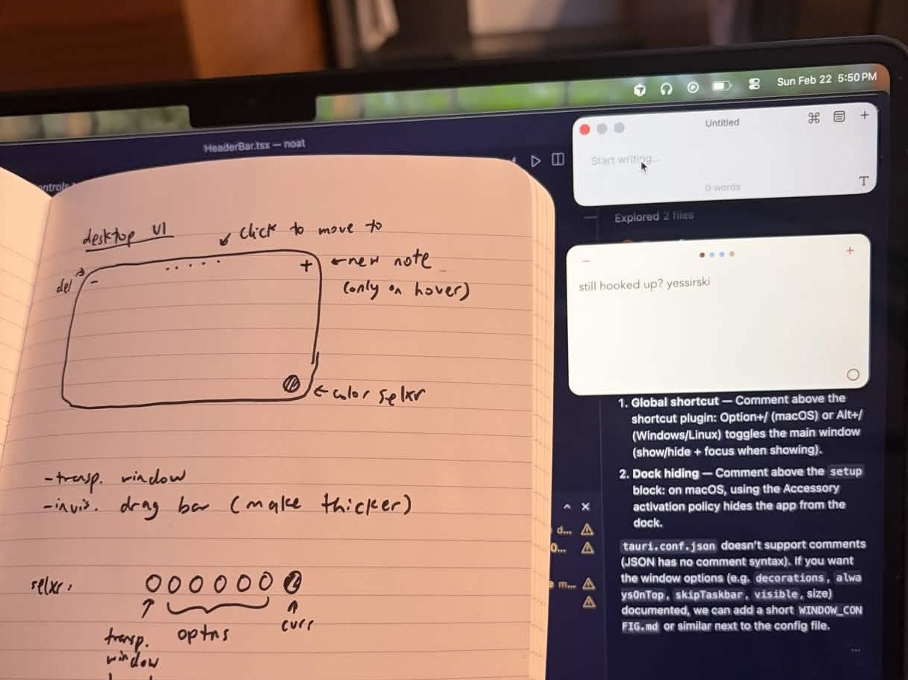
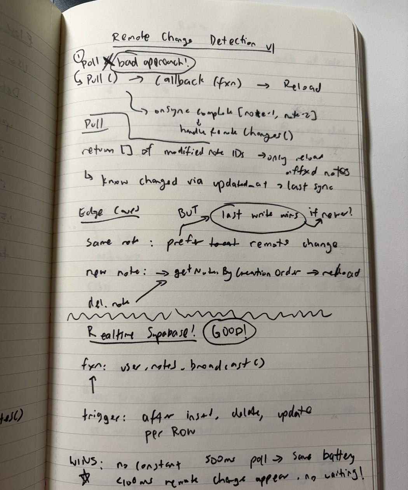
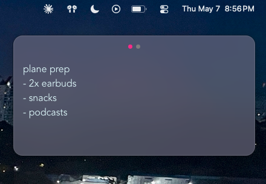

A few months ago, I [wrote about momentum](https://probablyalex.com/blog/rolling-downhill/) — about finding the right hill and rolling. Right around then, I started building something I'd been wanting to make for a while: **a minimalist note-taking app with realtime cross-device sync, like Raycast Floating Notes but with sync**. With sync between my Mac and my iPhone, I'd stop DM-ing myself reminders and finally have a shared "L1 cache" on hand.

I spent the next month building noat on nights and weekends after work. Now that I'm back home, I can write about how it went.



## What's noat?

In a noatshell:
- TWO connected apps: Translucent floating window on macOS (Tauri + Rust + React); native iOS/Android app on phone (Expo)
- Global shortcut (Option + /) to toggle desktop window visibility + 5 colour themes
- Local-first SQLite — works fully offline
- Cross-device sync in under 100ms via Supabase Postgres Changes

Existing notes apps didn't feel right; they were too clunky and complicated. I had strong opinions about how this should work, so I built it. [Code on GitHub](https://github.com/probablyalexzhu/noat).

## The Development Process

I had a notebook from work I'd never used, so I started using it to plan noat. It helped to be able to quickly draft up designs, draw architectural diagrams, and focus on the big picture instead of the details.

On a roadtrip to Big Sur with my roommates, I brought the notebook along to keep brainstorming. That felt really cringe, but once I **accepted the cringe** and kept going, it stopped mattering.



During the development of noat, I attended Claude Code's first birthday party and came back wanting to level-up my *clauding* — running agents and subagents in parallel, plus the superpowers plugin, /insights, and more.

With Claude in the loop, I picked up a lot of new languages and technologies faster:
- a bit of **Rust** on the Tauri app
- **mobile development** w/ Expo. Running noat on my actual iPhone felt sick
- **Supabase realtime** end-to-end — postgres_changes, subscriptions, replica identity, etc.
- consolidating separate apps into a **monorepo** for the first time

Talking to friends during the development was also great fun. I got to practice my asking-customers-what-they-want muscle without leading them on. My friend Taira went the furthest with it, and she even brought noat up to an investor, who said that it should have AI and be built for agents because of course they did! She also suggested I apply to Compound VC's Reverie Grants, at which point I discovered they already had a company named Noat in their portfolio — a nicotine company. 🚬

## Technical Learnings

### Polling to realtime

The first version was a 500ms poll loop with a 3s push debounce before pushing to the server. It "worked," but it had three problems: polling drained the battery, inbound latency was up to 3.5s, and the filter that prevented feedback loops based on `device_id` accidentally blocked legitimate same-device updates that were still in flight.

The fix was to migrate from polling to Supabase Realtime — a websocket subscription that pushes row-level events as soon as the database commits them. Pull became immediate, overriding local changes (<100ms). Push kept the debounce so keystrokes still get batched into one network call.



### The delete bug

Right after migrating to realtime, deleting notes stopped syncing between devices. Inserts and updates worked fine — but if you deleted a note on the desktop, your iPhone kept showing it.

The cause: Supabase's default `REPLICA IDENTITY` for a Postgres table only includes the primary key in DELETE payloads, no `user_id`. So my realtime filter `user_id=eq.${userId}` was checking a payload that didn't have a `user_id`, and the event got **silently dropped** server-side.

The fix: stop relying on filtered DELETE events entirely. Each device only stores its own user's notes locally, so deleting by `id` is safe even without ownership verification. As a safety net, on app focus, the client re-pulls the current state from Supabase and reconciles any local rows that no longer exist. Turns out that pull-on-focus pass is necessary anyway for offline correctness — so the workaround actually *removed work, not added it*.

### Monorepomaxxing

I started with just the mobile app, so I had to figure out how to add the desktop app and consolidate them into a monorepo.

```
noat/
  apps/
    desktop/        # Tauri (Rust + React + Vite)
    mobile/         # Expo / React Native
  packages/
    sync/           # @noat/sync — Supabase client + shared types
  package.json      # workspaces: ["apps/*", "packages/*"]
```

`@noat/sync` exports the Supabase client and shared types so both apps stay in sync (no pun intended). The actual sync *logic* stays per-platform — `expo-sqlite` is sync and Tauri's `plugin-sql` is async, so they can't share function signatures. The benefit isn't code reuse, it's *workflow*: one PR, one place to run commands, one place for Claude to think.



## Ending on a positive noat

Once noat was working for me, the remaining work was auth, app store distribution, the unglamorous shipping stuff. noat hit the goals I set for it: cross-platform architecture, a real Tauri app with native macOS integration, Supabase realtime end-to-end. I learned what I came to learn. Archived at v0.1.

After noat, I started shipping debatecomps.com, a directory of debate tournaments and opportunities for the global debate community. It started as an idea we explored in a software engineering capstone course last year, but it was too useful to leave unfinished. My debate partner Advait and friend Acon worked to expand our data sources into Canada and India, the latter of which now drives most of our traffic. In our first month after announcing it on Facebook, we had 700+ visitors and great feedback from debaters internationally.

*The rolling downhill continues.*